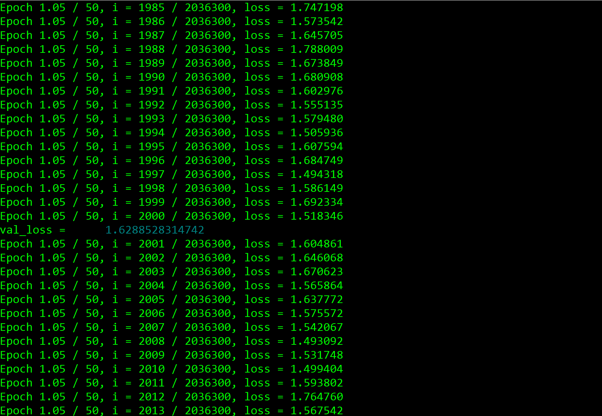

# The Author Function: Imitating Grant Allen with Queer Writing Machines

> “I cannot choose but wonder who each is, and why he is here. For one after another I invent a story. It may not be the true story, but at least it amuses me.” —Grant Allen, *The Type-writer Girl.*

This repository contains files for "The Author Function," a project that uses machine learning to imitate the style of Grant Allen (1848-1899), a nineteenth-century author who wrote (in) a variety of genres and topics, and under various pseudonyms—one of which was cross-gendered (“Olive Pratt Rayner”). This female persona makes his work an interesting case study in performative authorship. Allen was also markedly interested in the dramatic movements in both women’s rights and female-gendered clerical work during the 1870s-1890s, which makes him a good case study for mechanical reproduction and its relation to gendered authorship, both then and now.

To imitate Allen's writing style, I harnessed the power of artificial neural networks (ANNs), which are computer systems modelled loosely on the structure and behaviour of the human brain. In particular, I used the code module torch-rnn, written by Justin Johnson, to "train" an ANN on Allen's writings. After the training process, I then call on or "sample" the network to generate strings of text based on the texts' unique stylistic features (as learned and represented by the ANN).

"The Author Function" is a modest first step in a larger project of exploring the possibilities of machine learning and imitation in/for cultural or literary research. It draws from work by Kari Krauss and Lisa Samuels and Jerome McGann on subjunctive criticism and systematic alterations of text. In their research, these scholars emphasize the potential of speculation: what could we learn about our object of inquiry (e.g. a work of literature) if we broke it down, remade it, and compared or interpreted it alongside, or even as if it were, the original?

In practice and purpose, this project also shares characteristics with other forms or practices of electronic literature or, more specifically, generative or "computational creative" writing such as Twitter bots ([Goodwin](www.medium.com/artists-and-machine-intelligence/adventures-in-narrated-reality-6516ff395ba3); [Kazemi](http://tinysubversions.com/); [Parrish](www.decontextualize.com); [Sample](www.medium.com/@samplereality/a-protest-bot-is-a-bot-so-specific-you-cant-mistake-it-for-bullshit-90fe10b7fbaa); [Sloan](https://www.robinsloan.com/notes/writing-with-the-machine/)). These creative practices all disarticulate written text or language into component parts before rearranging and recombining them in novel formations. (There are, however, significant differences between machine learning and other generative techniques: see ["Anatomy"].) Articulated in Victorian-era terms, this project is like conducting a séance with a computer, rather than an Ouija board. Framed as a methodological experiment, "The Author Function" asks whether a kind of computer-assisted forgery can tell us anything of academic, literary, or cultural value—and, if so, what might it say?

[Continue to "Context"](context) or scroll down for descriptions of each section: Context, Composition, Corpus, and Code.

## Table of Contents

### Context
* [The Anatomy of Neural Networks](context.md/#anatomy)
  * [Enter torch-rnn](context.md/#enter)
* [Grant Allen: a Case Study](context.md/#allen)
  * [The Anxiety of Authorship](context.md/#anxiety)
  * [Queer Writing Machines](context.md/#queer)
  * [Possible Future Directions](context.md/#future)
* [Works Cited](context.md/#citeCont)

### Composition
* [Getting Started](composition.md/#started)
* [Interface and Interpretation](composition.md/#interface)
* [Optimizing Hyper-parameters](composition.md/#params)
  * [A Model's Fit: Training vs. Validation Loss](composition.md/#fit)
  * [Changing the Rate of Descent: Learning Decay](composition.md/#rate)
  * [Training Speed and Duration: Max Epochs, Batch Size, and Early Stopping](composition.md/#speed)
  * [Sequence Length](composition.md/#seq)
  * [Stopping and Starting Training](composition.md/#stop)
* [Works Cited](composition.md/#citeCre)

### Corpus

### Code
* [Notes on Running the Scripts, Navigating Directories](code/README.md/#notes)
* [The Scripts in More Detail](code/README.md/#scripts)

## Context

This document contextualizes and interprets the project in terms of its cultural, historical, and technological significance or implications. It gives a brief overview of machine/deep learning and discusses how this technology came to be available to non-specialists. It also explains why Grant Allen (1848-1899) makes a good case study, as well as points to possible future directions for research.

## Composition

This document provides more detailed and explicit explanations of, and instructions and tips for, machine learning with torch-rnn: a code module developed by Justin Johnson, based on work by Andrej Karpathy.

## Corpus

This folder contains a collection and description of the 32 .txt files used to train the neural network.

## Code

This folder contains scripts that I wrote in the programming language Python to preprocess the data (e.g. deleting chapter titles, illustration tags) before feeding it into the neural network.

## Works Cited

Goodwin, Ross. “Adventures in Narrated Reality: New forms & interfaces for written language, enabled by machine intelligence.” *Artists and Machine Intelligence*, *Medium.com*, www.medium.com/artists-and-machine-intelligence/adventures-in-narrated-reality-6516ff395ba3

Kazemi, Darius. *Tiny Subversions*, n.d. http://tinysubversions.com/

Kraus, Kari. “Conjectural Criticism: Computing Past and Future Texts.” *Digital Humanities Quarterly*, vol. 3, no. 4, 2009, n.p.

Parrish, Allison. *Decontextualize: Allison Parrish: words and projects*, 2016, www.decontextualize.com 

Sample, Mark. “A protest bot is a bot so specific you can’t mistake it for bullshit: A Call for Bots of Conviction.” *Medium.com*, 30 May 2014. www.medium.com/@samplereality/a-protest-bot-is-a-bot-so-specific-you-cant-mistake-it-for-bullshit-90fe10b7fbaa

Samuels, Lisa and Jerome McGann. “Deformance and Interpretation.” *New Literary History*, vol. 30, no. 1, 1999, pp. 25-26.

Sloan, Robin. "Writing with the machine." *Robinsloan.com*, n.d. https://www.robinsloan.com/notes/writing-with-the-machine/

## Version

Will write this later.

## License

Will write this later.

## Acknowledgements

Will write this later.
