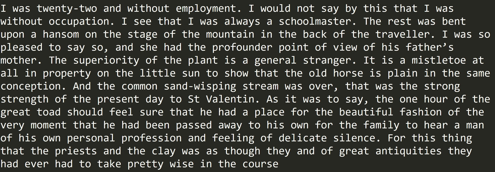
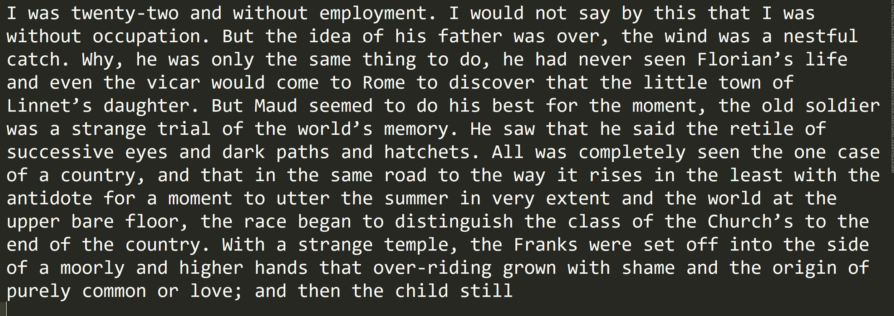
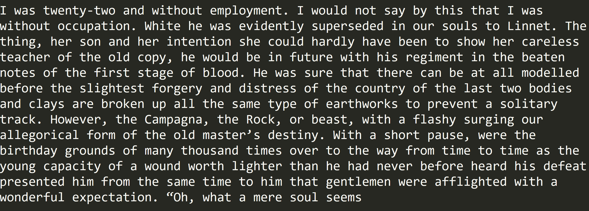
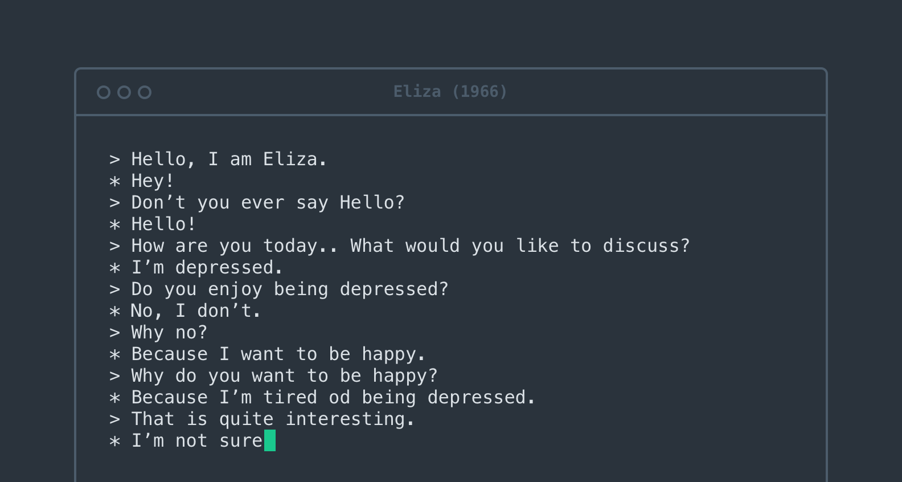
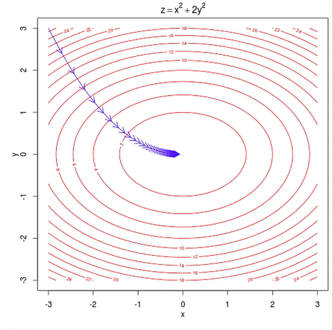
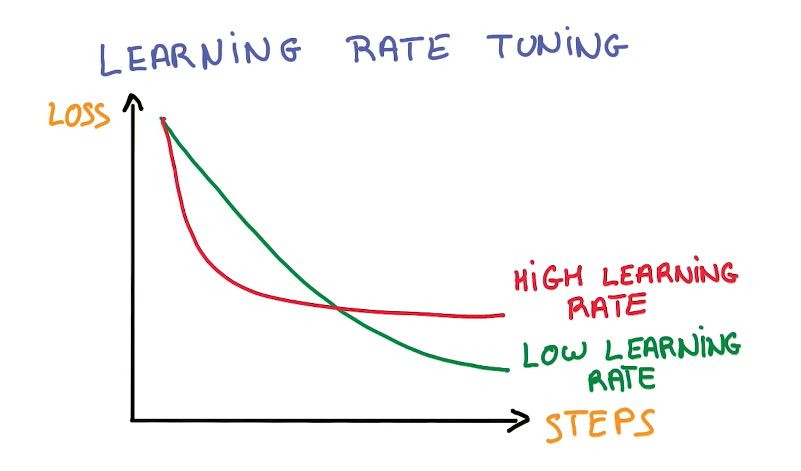

# The Author Function: Imitating Grant Allen with Queer Writing Machines

> “I cannot choose but wonder who each is, and why he is here. For one after another I invent a story. It may not be the true story, but at least it amuses me.” — Grant Allen, *The Type-writer Girl.*

This repository contains files for "The Author Function," a project that uses machine learning to computationally imitate the style of Grant Allen (1848-1899), a nineteenth-century author who wrote in a variety of genres and under various pseudonyms. To imitate Allen's writing style, I harnessed the power of artificial neural networks (ANNs), which are computer systems modelled loosely on the structure and behaviour of the human brain. In particular, I used the code module [torch-rnn](https://github.com/jcjohnson/torch-rnn), written by Justin Johnson, to "train" an ANN on Allen's writing.  Unlike more conventional programming, ANNs do not use explicit or hand-coded instructions to produce a determined output. Instead, the output of this process can be said to be the ANN or model itself (see ["Anatomy"](#the-anatomy-of-neural-networks) for more)([Burger](http://pages.cs.wisc.edu/~bolo/shipyard/neural/local.html)). After training, I then sample or call on the network to generate novel strings of text based on the training data's unique stylistic features (as learned by the ANN).

In practice and purpose, this project resembles certain forms or practices of electronic literature—or, more specifically, generative or "computational creative" writing such as Twitter bots ([Goodwin](https://medium.com/artists-and-machine-intelligence/adventures-in-narrated-reality-6516ff395ba3); [Kazemi](http://tinysubversions.com/); [Parrish](http://www.decontextualize.com); [Sample](https://medium.com/@samplereality/a-protest-bot-is-a-bot-so-specific-you-cant-mistake-it-for-bullshit-90fe10b7fbaa); [Sloan](https://www.robinsloan.com/notes/writing-with-the-machine/)). These creative practices all disarticulate written text or language into component parts before rearranging and recombining them in novel formations. What seems, in one sense, like reanimating the author after literary theory and criticism have proclaimed their death (Barthes) might, in another, seem to make the author obsolete. Although I doubt robots will replace human poets anytime soon, I believe that computational creative writing does not detract from but *enriches* creative writing writ broadly: it presents questions, challenges, and possibilities that we have not or may not have otherwise considered.


*Image: Sample text written by the ANN.*

This project takes its name and inspiration from Foucault's concept of the author as not as a straightforward reference to a single person, but the effect of material and cultural influences that combine and congeal into what we consider authorship to be or mean. Foucault refers to these effects as like a mathematical function and a process that serves a political utility. I take this function to a literal extreme by transforming Grant Allen's style as a unique, identifying feature of the author, into an executable computer function—a procedure used to express, calculate, or manipulate values.

I chose Grant Allen because he makes an interesting case study for performative authorship. In recent years, contemporary scholars have revisited Allen's life and work. Many scholars discuss the clash between Allen's political (e.g. in women's rights) and artistic aspirations, and how market pressures greatly influenced not only what he wrote, but how he positioned or presented himself in relation to it (Greenslade and Rodgers; Morton; Warne and Colligan). As I later discuss (see ["Context"](#grant-allen-a-case-study)), Allen wrote in a cultural moment and milieu that makes him a good case study for mechanical reproduction and its relation to gendered authorship, both then and now. Current debates or fears about artificial intelligence (AI) replacing human poets parallel nineteenth-century anxieties over who or what counts as a legitimate author or as authentic literature in an era of mass production and proliferating print culture. However, for my purposes, I am less interested in whether or not a computer *can or cannot* convincingly pass as Grant Allen than I am interested in what, specifically, the AI says that Allen (hypothetically-speaking) could have but did not.

Although I don't have very concrete findings, "The Author Function" is a modest first step in a larger project of exploring the possibilities of machine learning and imitation in/for cultural or literary research. It draws from work by Kari Krauss and Lisa Samuels and Jerome McGann on subjunctive criticism and systematic alterations of text. In their research, these scholars emphasize the potential of speculation: what could we learn about our object of inquiry (in this case, literature) if we broke down, remade, and compared or interpreted it alongside—or—even as if it were, the original? Articulated in Victorian-era terms, this project is like conducting a séance with a computer, rather than an Ouija board. Framed as a methodological experiment, "The Author Function" asks whether a kind of computer-assisted forgery can tell us anything of academic, literary, or cultural value—and, if so, what might it say?

## Acknowledgements

First, I acknowledge that I created this project on the traditional territories of the Songhees, Esquimalt, and WSÁNEĆ peoples, whose historical relationships and stewardship of the land continues to this day. My growth as a scholar and a person would not have been possible without the land on which I have studied, worked, and lived for the past three years. I am also grateful to Dr. Jentery Sayers, who has mentored and supported me from the very first days of my Master's. I couldn't imagine my graduate career without the formative experiences of working with the MLab and all the fruitful conversations that have emerged from it. Thanks to Dr. Mary Elizabeth Leighton for her support, especially in the early stages of my research and writing process, and for pulling me out of difficult spots when needed. And lastly, a very heartfelt thank you to all the cherished friends and fellow scholars who have helped me through a very rough year. I could not have done it without you.

## Version

This is version 1.0 of The Author Function.

## License

<a rel="license" href="http://creativecommons.org/licenses/by-nc-sa/4.0/"></a><br/></a>This work is licensed under a <a rel="license" href="http://creativecommons.org/licenses/by-nc-sa/4.0/">Creative Commons Attribution-NonCommercial-ShareAlike 4.0 International License</a>.

## Table of Contents

### Context
* [The Anatomy of Neural Networks](#the-anatomy-of-neural-networks)
  * [Enter torch-rnn](#enter-torch-rnn)
* [Grant Allen: a Case Study](#grant-allen-a-case-study)
  * [The Anxiety of Authorship](#the-anxiety-of-authorship)
  * [Queer Writing Machines](#queer-writing-machines)
* [Possible Future Directions](#possible-future-directions)

### Composition
* [Getting Started](#getting-started)
* [Interface and Interpretation](#interface-and-interpretating-results)
* [Optimizing Hyper-parameters](#optimizing-hyper-parameters)
  * [A Model's Fit: Training vs. Validation Loss](#a-models-fit-training-vs-validation-loss)
  * [Changing the Rate of Descent: Learning Decay](#changing-the-rate-of-descent-learning-decay)
  * [Training Speed and Duration: Max Epochs, Batch Size, and Early Stopping](#training-speed-and-duration-max-epochs-batch-size-and-early-stopping)
  * [Sequence Length](#sequence-length)
  * [Stopping and Starting Training](#stopping-and-starting-training)
* [Findings](#findings)

### Code
* [Notes on Running the Scripts, Navigating Directories](#notes-on-running-the-scripts-navigating-directories)
* [The Scripts in More Detail](#the-scripts-in-more-detail)

### Corpus

A [collection and description](corpus) of the 32 .txt files used to train the neural network. [Click here](#corpus-1) for more description and details.

### Works Cited

[Sources](#works-cited-1) and further reading.

## Context


*Images: a portrait of Grant Allen (left), an illustration of a simple neural network's layers (centre), a typist typing with a Sholes typewriter (right)*

### The Anatomy of Neural Networks

This project uses [torch-rnn](https://github.com/jcjohnson/torch-rnn), a series of modules, written for the Torch framework by Justin Johnson and based on Andrej Karpathy’s [char-rnn](https://github.com/karpathy/char-rnn), that generates text using artificial neural networks ("ANNs"). ANNs are computer systems that loosely mimic the human brain. They consist of networks of neuron-like "nodes" that are grouped into layers, with nodes from one layer connected to nodes in other layers (see Fig. 1).


*Figure 1: Illustration of a neural network with arrows showing how information travels through it. Image by Colin M. Burnett, care of Wikimedia Commons.*

Where we might typically expect a program or algorithm to execute a list of instructions sequentially or line-by-line, the nodes in an ANN fire simultaneously (in parallel) across the connections between nodes and/or between layers. Fig. 1 illustrates how this firing sequence, called “forward propagation,” works over time, making its way from the input layer, through intervening layers, until it reaches the final, output layer. The more numerous or dense the hidden layers, the larger, more complex, and more powerful the ANN.

Before forward propagation begins, the ANN sets a small portion of data aside called validation data (more on this later), and assigns a weight to each connection or synapse. (For its initial pass, the network uses a random value.) As input values move through the layers, the ANN multiplies them by the synaptic weights and then calculates the sum total activation (see Fig. 2).


*Figure 2: Animated GIF of forward propagation. Note the weight of each connection represented by W. Animation sampled from an animated GIF by Wil C.*

Forward propagation stops with the output layer. At this point, the ANN calculates the degree of error and then, in a process called backpropagation, it goes backwards through the layers and adjusts the weight of each connection to produce better results the next time.  As the network cycles its way through the data, propagating forwards and backwards and adjusting the weights accordingly, it learns. That is, it improves its guesses by reducing or minimizing the error (the distance between its guess and the correct value) over time. With torch-rnn and other recurrent neural networks, the ANN learns, not only from its previous guess and its context (what comes before and after the target), but also from a whole history of previous guesses and their contexts. This learning process is called training (a neural network) (see Fig. 3).


*Figure 3: Animated GIF of one full cycle of activation, including forward propagation and backpropagation. Animation sampled from a GIF by Wil C.*

Once the training process is complete, we can ask a trained ANN to generate a novel sequence—that is, to "sample" from the network—by running in forward propagation mode only, using the weights it learned while training.

#### Enter torch-rnn


In May 2015, Andrej Karpathy published ["The Unreasonable Effectiveness of Recurrent Neural Networks"](http://karpathy.github.io/2015/05/21/rnn-effectiveness/) and made [the accompanying code](https://github.com/karpathy/char-rnn) free and available online. Like its name suggests, char-rnn allows you to train an ANN on a corpus of your choosing and then generate novel text character by character, in two-character sets. Since then, many others have adapted Karpathy's code or method for their own projects (e.g. Ross Goodwin's work in ["Narrated Reality"](https://medium.com/artists-and-machine-intelligence/adventures-in-narrated-reality-6516ff395ba3), Lars Hiller Eidnes' [word-rnn](https://github.com/larspars/word-rnn), Aaron Ng's [Netflix synposis generator](https://medium.com/aaronn/generating-netflix-synopses-with-a-recurrent-neural-network-e8aef791fdce)).

One such project is torch-rnn, an improved version of char-rnn that I adopted for my own project. Like char-rnn, torch-rnn allows us to create, train, and sample ANNs on personal computers without advanced knowledge or formal training in Computer Science or statistics. Instead, we can adjust a list of settings, called flags or hyper-parameters (see [“Optimizing Hyper-parameters”](https://github.com/jcjohnson/torch-rnn/blob/master/doc/flags.md)), to be used by the ANN when preprocessing, training, or sampling from the network.

More simply put, torch-rnn lets me imitate Grant Allen’s style (as calculated by the ANN) by training it on selected works available at [Project Gutenberg](http://onlinebooks.library.upenn.edu/webbin/gutbook/author?name=Allen%2C%20Grant%2C%201848-1899) (see the [“Corpus” folder](corpus) for more). I then sample from the model to produce novel text (see Fig. 4)—text that Allen did not write but, hypothetically-speaking, could have.


Sample 1	               |  Sample 2
:-------------------------:|:-------------------------:
  | 

Sample 3				   |    Sample 4
:-------------------------:|:-------------------------:
  | 

*Figure 4: Pictures of samples written by the model. Click on an image to enlarge.*

### Grant Allen: a Case Study

Grant Allen (1848-1899) wrote in many different genres and disciplines; he wrote both fiction (e.g. short stories, novels) and non-fiction (e.g. essays, scientific articles, travel guides). In 1876, he began writing professionally and published short stories under pen names such as J. Arbuthnot Wilson and Cecil Power ("Grant Allen"). He also published *The Type-writer Girl* (1897) and *Rosalba* (1899) under a cross-gendered pseudonym, Olive Pratt Rayner ("Grant Allen"). An extremely productive writer, he wrote more than thirty works of fiction in fifteen years with *The Woman who Did*(1895) becoming his most popular and lucrative achievement ("Grant Allen"). *The Woman Who Did*, which depicts a young woman who struggles against gender conventions, is generally read as sympathetic to women's rights and emancipation. It attracted as much criticism and satire as it did fame or admiration: for example, *Punch*, a popular and well-known satiric magazine, turned "The Woman Who..." into a catchphrase (Warne and Colligan 21-22).

In the latter half of the nineteenth century, Allen witnessed many changes in literary production and circulation. Automation and technological innovations increased the sheer volume of print material while lowering costs. At the same time, social changes, such as strong emphasis on education and the rising middle-class, meant that print material could reach far broader audiences than before. But although technological advances and decreasing costs may have made nineteenth-century books literature more accessible, they did not solve cultural debate about who counts as an author and what counts as "authentic" literature. 

### The Anxiety of Authorship

Throughout his life and career, Allen was very self-conscious and concerned with his own authorial identity and writing personae. Not only did he write under at least three pseudonyms on several occasions ("Grant Allen"), he even went to great lengths to create a backstory for "Olive Pratt Rayner" ("Literary Notes"); dedicate "her" novels to a fictional husband and brother (Allen 7); and insisted that no one know his identity as author until after his death ("News in Brief"). Furthermore, Vanessa Warne and Colette Colligan suggest that Allen's use of a cross-gender pseudonym and other writings reflect anxieties over writing as a male author in a genre with a largely female audience.


*Figure 5: An posthumous note in* the Australasian *about "Olive Pratt Rayner."*

*The Type-writer Girl* also troubles any neat categorization of gender through multiple layers of imitation. For example, Allen's use of a cross-gendered pseudonym might expose the instability of gender roles or binaries—that is, their susceptibility to being faked—even as it can reinforce dominant conventions (e.g. the convention of female writers writing for a female market). Perhaps more subtly, the female protagonist creates a double disguise: Allen is writing as a woman writing (in first-person) as a female character (Cameron). And, as Cameron notes, it is possible that a reader might assume Rayner was writing from personal experience, giving the work an air of authenticity (236). Using machine learning to imitate Allen's style echoes Allen's own gender imitations or personae in his writing.

*The Type-writer Girl* thematizes issues of gender, authorship, and authenticity. Somewhat like Allen himself, the novel's protagonist, Juliet Appleton, struggles to write original, creative literature while working as a typist, mindlessly transcribing and copying the words of her male boss. In Appleton, the novel presents a positive model for women's emancipation: a woman who is educated, talented, and has financial independence. Appleton's profession alludes to female labour and contributions to textual and literary production that are generally overlooked. In Allen's time, the labour of reproduction or duplication was gendered female and held a much lower status than the work of a masculine, original, and creative mind (Keep; Plant; Wosk). A typist or copyist worked for financial gain while a genius pursued an artistic vision; a genius creates and innovates while a hack merely imitates what has been done before.

### Queer Writing Machines

Allen's imitation game brings to mind early imitation games of AI (ca. 1950s)—games that test a machine's ability to convincingly imitate human beings. The most famous of these is "the Turing test," in which a human interlocutor converses with two participants: one is a human while the other is an AI imitating a human. If the AI is able to convince the interlocutor, the AI is said to pass the Turing test. It is perhaps fitting, then, to imitate Allen’s writing using a neural network that (albeit very loosely) imitates the workings of a human brain. Furthermore, what is often ignored is that Turing's original test as he described it is explicitly about gender imitation rather than the imitation of a supposedly universal human essence. In fact, for an AI to pass Turing's original imitation game, it would have to convincingly imitate a man imitating a woman (n.p.). Both Allen and Turing's imitation games are couched in the imitation of gender specifically, suggesting that intelligence, whether human or artificial, cannot exist outside of or divorced from cultural concerns such as gender.



*Figure 6: an image of a conversation with Eliza, one of the first "chatbots" (machines meant for simulating human conversation) ever made. Image care of Anna Szymcak (https://blog.infermedica.com/introduction-to-chatbots-in-healthcare/).*

Moreover, late twentieth-century anxieties that AI will replace human authors might strangely echo nineteenth-century anxieties over the decline of handcraft or reactions against automation and mechanical reproduction (e.g. Ludditism or the Arts and Craft Movement). However, then as now, new or mass-market technologies did not straightorwardly or completely replace craft so much as it morphs or develops in response to them (Adamson 44). Similarly, as Ross Goodwin argues, machine learning and other forms of generative art do not replace humans; instead, they offer more, not less, affordances, spaces, and techniques for composition (n.p.). In both cases, the former attitude deemphasizes human agency and labour in designing, making, operating, and maintaining the machine. Furthermore, in terms of aesthetics, the human or handmade is not necessarily better or more desirable than, or even neatly separable from, the machine-made. For example, eighteenth-century artisans might well have sought the very regularity and efficiency in their work that later became disparaged and denigrated as the aesthetics of mechanical reproduction (Adamson 44). 

As biographer Richard Le Gallienne writes of Allen,

>"In the merely mechanical—but how important—matter of 'turning out' his 'copy' he was quite amazing. Anyone who stayed in his house will remember how his typewriter could be heard, as you crossed the hall, punctually beginning to click at nine every morning and, if you eavesdropped, you would seldom note a pause in its rapid clicking." (204)

This spectacle of productivity, as Leah Price notes, "Like the semantic ambiguity of the term 'type-writer' — person or thing? — Allen's 'merely mechanical' writing reduces him to a metonymic extension of his machine" (138). Price also writes that Allen's role in demonstrating the capabilities of a typewriter, of which Allen himself was one of the first early adopters, might align him with other notable demonstrators: women that typewriter companies relied on to advertise and market their products.


*Figure 7: Lillian Sholes, with one of her father's (Christopher Latham Sholes') experimental typewriters (ca. 1872). Image information from Wosk (p. 24), image care of the University of Wisconsin Digital Collections Center.*

Although Allen does not and cannot embody or inhabit the position of women in this context, he does at least test the elasticity of such gender categories. Furthermore, Allen's own struggle to assert his originality despite churning out his "'copy'"—the very same struggle Juliet Appleton grapples with—might have highlighted both the plight and lowered status of textual reproduction. He challenged the binary distinction between duplication and creative work, as well as their gendered inflections. Or, to put it differently, Grant Allen was a queer writing machine.

### Possible Future Directions

Like *The Woman who Did*, much of Allen’s work deals with themes of gender and female emancipation in particular. For example, *The Type-writer Girl* features a headstrong female protagonist who is determined to support herself financially and chooses not to marry in spite of her love interest’s affections. (*The Type-writer Girl*) However, Allen’s own gender politics are both controversial and contested in current scholarship. Although he wrote explicitly in support of women’s rights and independence, many scholars note that he seemed unable to reconcile this with his Darwinist emphasis on reproduction and motherhood (Atchison; Cameron). If we use a neural network and train it on his writing, we could produce text that Grant Allen never wrote but *theoretically could have*. As a kind of speculative exercise, (Krauss; Rosner; Samuels and McGann) we could then interpret this artificially-produced text as if it were the original. By itself or through comparative analysis with the original, this process might tell us something new about gender politics in the late nineteenth century that we might not have learned otherwise.

Furthermore, we might link the Author Function's gender imitation to gender performativity. First coined by Judith Butler, performativity refers to the coerced repetition or performance of a gender ideal that is never realized as authentic, despite all attempts. Similarly, my project also functions as a kind of imitation without an original: it automates the performance of authorship in search of novel conceptions of gender that congeal over time and through repetition, rather than seek to uncover what Grant Allen personally "really meant." Although a full discussion of gender is outside the scope of this project, it’s worth considering how this project might productively speak to forgotten queer histories of computing.

Lastly, neural networks, as a medium or methodology, are relatively opaque when compared to other kinds of programming. Although we may design the general architecture of a model (via parameters), we do not have explicit control once the training process starts and can’t see the results until the training process has ended. Neural networks are unique in this. Where we might normally expect a program to execute a specific set of instructions to produce a deterministic output, the "output" of a neural network is the model itself—which in turn becomes a platform for generating its own outputs ([Berger n.p.](http://pages.cs.wisc.edu/~bolo/shipyard/neural/local.html)). Placed alongside other forms of generative writing, this project also invokes an “aesthetic of surprise” that emerges when designers confront, or concede, an absence of control. ([Howe and Soderman n.p.](http://hyperrhiz.io/hyperrhiz06/essays/the-aesthetics-of-generative-literature-lessons-from-a-digital-writing-workshop.html)) In this project, I tried to walk the line between surprise (what is unexpected) and coherence (what is legible). In this way, imitation exceeds rote repetition and becomes a creative endeavour in and of itself. In other words, imitation demands some measure of originality—some might even say authenticity—even as it passes as a convincing duplicate of something else.

## Composition

I ran the following software on my personal laptop, which has a 64-bit Windows operating system and 8.00 GB of RAM (Random Access Memory). To simulate a Linux operating system, I used Bash on Ubuntu on Windows.


*Figure 8: a screenshot of the torch-rnn Github page.*

### Getting Started

Running torch-rnn requires a number of dependencies that are all listed on the [torch-rnn page](https://github.com/jcjohnson/torch-rnn). You will need to install [Python](https://www.python.org/) and [Lua](https://www.lua.org/manual/5.3/readme.html) before installing [Torch](http://torch.ch/). Note that the commands listed there are meant to be entered into a Linux command line (see ["Getting to Know the Command Line"](https://www.davidbaumgold.com/tutorials/command-line/) by David Baumgold).

If you have Windows 10, I highly recommend using Bash on Ubuntu on Windows so that you can type in the commands as is. (There are [several](https://www.howtogeek.com/249966/how-to-install-and-use-the-linux-bash-shell-on-windows-10/) [tutorials](https://msdn.microsoft.com/en-us/commandline/wsl/install_guide) on the web that walk you through installation.) If you have older versions of Windows, consider upgrading or installing a shell such as [Cygwin](http://www.cygwin.com/), [Babun](https://babun.github.io/), or [win-bash](http://win-bash.sourceforge.net/). If you have a Mac, you can open the Terminal (command line interface) via Applications > Utilities > Terminal.

Installing and using a GPU (Graphics Processing Unit) is optional and you have to check if your computer meets the requirements first. A GPU would allow you to train your models much faster, although there are some options for increasing performance with a CPU only (see "Optimizing Hyper-parameters").

### Interface and Interpreting Results

Modelling and using a neural network consists of [three steps](https://github.com/jcjohnson/torch-rnn).

1. **Preprocessing**: running a Python script to prepare the data (a .txt file) for training.

2. **Training**: running a script to train a neural network on your data.

3. **Sampling**: once the neural network has been trained, you can generate samples of text based on what the network learned.

During all three steps, you can configure what are called [flags](https://github.com/jcjohnson/torch-rnn/blob/master/doc/flags.md) or hyper-parameters: settings you can use to tweak or optimize your model (see ["Optimizing Hyper-parameters"](#optimizing-hyper-parameters)). You can get drastically different models by changing its hyper-parameters.

The goal of the training process is to minimize the loss value (a representation of the margin of error)—in particular validation loss, which represents how a model performs on unseen data. When sampling a checkpoint (see below), it is usually best to sample the checkpoint with the lowest validation loss (and hence your most accurate model).

Once you start the training process, you will see something like Fig. 9. From this interface, we can infer a number of characteristics.


*Figure 9: The interface for torch-rnn.*

**(Number of) Epoch(s):** An epoch is one full pass or cycle through the training data—i.e. your network has seen all of the samples once. The interface tells you the current epoch out of the total number of epochs (you can modify the total with the flag `--max_epochs`).

**Iteration(s):** The number of training iterations the model runs through, presented in the format `current iteration / total iterations`. The more complex your model, the more iterations it will need.

**Checkpoint:** Every 1000 iterations, torch-rnn saves a checkpoint from the model in the cv folder (e.g. `cv/checkpoint_10000.t7`). Once training is done, you pick a checkpoint at which to sample the model.

**Loss:** Loss represents the error rate for the model, so it follows that the goal of training is to minimize loss as much as possible.

**Training Loss:** This number represents how well the model predicts the data it’s currently training on. By default, the model prints training loss for every iteration.

**Validation Loss:** This number represents how well the model predicts data that was previously set aside before training (i.e. it is data that the model has never seen before). The model prints validation loss for the entire network every thousand iterations. This step may take a while to process depending on the size of your validation set.

### Optimizing Hyper-parameters

Although torch-rnn may make ANNs more accessible to non-specialists, optimizing the model to produce legible text can take a lot of time and trial-and-error. Neural networks like this one are "the ultimate ‘black boxes’. Apart from defining the general architecture of a network and perhaps initially seeding it with...random numbers, the user has no other role than to feed it input and watch it train and await the output" ([Burger n.p.](http://pages.cs.wisc.edu/~bolo/shipyard/neural/local.html)).

However, there are ways to adjust the architecture of the network by using hyper-parameters ("parameters") in order to drive the loss down and produce a better model. We can use this [list of flags](https://github.com/jcjohnson/torch-rnn/blob/master/doc/flags.md) to modify the parameters. In the following, I discuss a number of tips for the training and sampling process that I’ve compiled and synthesized from different sources.

It can be helpful to train on smaller bits of information first (but at least 1 MB’s worth of data) to get a feel for how the parameters work before training larger models, which obviously take more time. It is also helpful in the beginning to abort models that aren’t working out well (`Ctrl/Cmd + z`) instead of letting the model run; that way you can test a different set of parameters more quickly.

#### A Model’s "Fit": Training Loss vs. Validation Loss

As I said before, the goal of training is to minimize both types of loss, which should decrease over time as the model works its way through the data. If we were to plot the loss through time, it would initially decrease quickly and then gradually slow down as it approaches minimal loss. For more on general information on gradient descent, see [Tejani](https://alykhantejani.github.io/a-brief-introduction-to-gradient-descent/). See “Gradient Clipping” for more on how to adjust the gradient itself.



*Figure 10: Graph illustrating gradient descent as the arrow travels towards a minimum loss point. Animation care of Lijia Yu (http://vis.supstat.com/2013/03/gradient-descent-algorithm-with-r/)*

In practice, the gradient is not quite so smooth and can fluctuate even as the overall trend slopes downward. I would recommend copying and pasting the information printed at every checkpoint into a blank Excel document so you can keep track of (training and validation) loss values and whether they are increasing or decreasing over time. This can be useful, not only for deciding which checkpoint you’d like to sample from later, but also to judge if a model is underfitting or overfitting by looking at the relationship between training and validation loss.

There are four possible scenarios:

1. If validation loss is consistently very similar or (almost equal) to training loss, your network may be **underfitting**: that is, your model is not predicting the training or validation data very well (see [Brownlee](https://machinelearningmastery.com/overfitting-and-underfitting-with-machine-learning-algorithms/) for more). To fix it, increase `-rnn_size` or `-num_layers` or even `-seq_length` (Karpathy n.p.).

2. If training loss is consistently much lower than validation loss, the model is **overfitting**, meaning your model is learning "too well" and starting to memorize sequences instead of predicting them[Brownlee](https://machinelearningmastery.com/overfitting-and-underfitting-with-machine-learning-algorithms/). Overfitting actually makes the model’s prediction less accurate by introducing errors into your data (Brownlee). To fix it, you can decrease the model size (using `-rnn_size` or `-num_layers`), increase dropout (`-dropout`), or stop the model early (press Ctrl/Cmd + z in command line to abort commands). The latter is known as “early stopping” ([Bengio](https://arxiv.org/pdf/1206.5533.pdf)); [Perchelt](http://page.mi.fu-berlin.de/prechelt/Biblio/stop_tricks1997.pdf)).

3. If validation loss is consistently slightly higher than your training loss (by around 0.1 or slightly more), then your model has a **good fit**.

4. If validation loss is consistently and significantly lower than your training loss then **the fit is unknown** ([cdeterman](https://stats.stackexchange.com/questions/187335/validation-error-less-than-training-error)). This is unusual because it means your model is predicting completely new information better than the information on which it’s trained. Increasing the size of the model seems to help.

As an overall strategy, Karpathy recommends deliberately overfitting a model and then using different dropout values to get a better fit ([Karpathy n.p.](https://github.com/karpathy/char-rnn)).

#### Changing the Rate of Descent: Learning Decay

As previously stated, the loss value can be plotted along a decreasing gradient. Torch-rnn allows you to adjust the gradient using the flags `-lr_decay_every`, `-lr_decay_factor,` and `-grad_clip` (see [torch-rnn flags](https://github.com/jcjohnson/torch-rnn/blob/master/doc/flags.md#training) for definitions and details). A common way to smooth the gradient is gradient clipping, which normalizes values that stray out of an accepted range (Grosse). If your loss fluctuates a lot, you can increase/adjust gradient clipping to decrease the bouncing.

`-lr_decay_every` and `-lr_decay_factor`affect the shape of the gradient. Increasing these numbers would make the gradient steeper while decreasing them will do the opposite. In practice, it is best to strike a balance between the two. Too steep and the loss will plateau and not decrease as much as it could have if the curve were more gradual; however, if the curve is too gradual or shallow, the model will take a lot of time to train (see Fig. 11)([Udacity](https://www.udacity.com/course/deep-learning--ud730)).



*Figure 11: Graph of different learning gradients and how loss changes over time. Screenshot of a video by Udacity:(https://www.udacity.com/course/deep-learning--ud730).*

#### Training Speed and Duration: Max Epochs, Batch Size, and Early Stopping

`-max_epochs` controls how many rounds or passes the network makes at the data. Larger values lengthen the training process. One common practice is to deliberately overfit the network but stop the training process just before the loss begins to increase again (i.e. stop the network before it becomes less accurate). We could do this by lowering `-max_epochs` to cut off the gradient at a particular place, or stop the training process manually.

`-batch_size` specifies the amount of data that is processed in parallel (i.e. simultaneously). Lower batch sizes can appear to radically increase computation speed, but it also increases the variance of the loss value—i.e. the loss value appears to bounce up and down even as it decreases overall (Bengio 9). As a consequence, it may take more iterations to decrease noticeably, which in turn can increase computation time. Speaking from personal experience, I still generally find it faster and better overall to go with a small batch size (40 or below).

Early stopping refers to the practice of stopping or cutting off the training process before the network begins to overfit and lose accuracy (Bengio). If we chart the validation loss over time while overfitting, it would create a parobola-type shape; loss falls to a certain point and then begins to rise again as the network becomes too specific, losing its ability to generalize features to new data. With early stopping, we stop or cut off the training process at the sweet spot, where loss was the lowest, and sample from the corresponding checkpoint.

#### Sequence Length

Sequence length specifies the number of steps back a network looks at (when going through backpropagation). At larger `-seq_length` values, the network will be able to find broader patterns across a string of characters where the current step might depend on a step much further back. Consider, for example, trying to predict the last word in "the clouds are in the *sky*" vs. “I grew up in France . . . I speak perfect *French*” ([Olah n.p.](http://colah.github.io/posts/2015-08-Understanding-LSTMs/)). Increasing `seq_length` will also increase the total number of iterations.

#### Stopping and Starting Training

Training a network may take a lot of time (hours or, more likely, days). At any point, we can interrupt or abort the training process by typing `Cntrl/Cmd + z`. This can be particularly helpful when using the Early Stopping technique (see ["Training Speed and Duration"](#training-speed-and-duration-max-epochs-batch-size-and-early-stopping)); change parameters partway through; or if you want to shut down your computer or put it in standby/sleep mode. To (re)start the training process, use the `-init_from` flag and, optionally, the `reset iteration` tag.

### Findings

The resulting samples of the model are still fairly non-sensical and not likely to be mistaken for a human author any time soon (see the code folder for [examples](code/examples.txt). However, this is not necessarily a bad thing: for most writers of generative or computational creative writing, absurdity can be a defining feature. As with most if not all generative literature, it takes a lot of samples to produce something meaningful. As Goodwin notes, we can feed the network lines from the training corpus to push it to write more legibly, as well as adjust the temperature to produce either more random or more regular samples [(n.p.)](https://medium.com/artists-and-machine-intelligence/adventures-in-narrated-reality-6516ff395ba3). For example, with a low temperature, a model tends to yield samples that repeat words and/or syntactic structures with little punctuation. By contrast, a high temperature yields more variable but less sensical samples with relatively more punctuation (see Fig. 12). As Goodwin puts it, temperature represents how much creative risk a model takes (n.p.).

 
*Figure 12: A comparison of two samples: one produced with a low temperature (left) and one with a high temperature (right).*

Put differently, sampling is a balancing act between variance—what we might consider more surprising or creative—and coherence—what is recognizable as the logical or grammatical structure of English. Occasionally, the model will also produce non-words such as "cleeds" or "tade," although I'm not clear what exactly causes this or whether or not it can be influenced through training or preprocessing.

In future, the model would likely produce much better results if I fed it more data. However, I would likely need an effective way to correct for OCR errors. Most available transcriptions of Allen's work (e.g. on archive.org or through Hathi Trust) contain a significant number of errors that could influence training, especially if the total corpus is not particularly large. Goodwin discusses other techniques, such as resequencing paragraphs according to word frequency or simplifying proper names/nouns [(n.p.)](https://medium.com/artists-and-machine-intelligence/adventures-in-narrated-reality-part-ii-dc585af054cb). I have not tried these techniques but they may be fruitful.

## Code


*Image: a Python script I wrote to preprocess text files.*

This folder contains a number of python scripts I used to prepare the corpus for modelling. As an overview, I followed these general steps to prepare the file:

1. Download the file into two locations: samples/raw and samples/stripped. The raw folder contains backup copies of the files (as they were when downloaded). (See ["Corpus"](#corpus) for more.)
2. In the stripped folder, open each file and remove all paratextual material—i.e. copyright license, advertisements, table of contents, etc. that appear at the start or end of the file.
3. Once all the needed files have been stripped, run `cleanup.py`. `cleanup.py` reads every file, filters out unwanted lines and characters. Then it writes the results into one long string (i.e. without paragraph breaks or blank lines) into a file of the same name in the oneString folder. You can use `cleanup.py` for every .txt file in the folder, or give it specific target files.
4. Run ```mergeFiles.py``` to create one long file by appending all the files in oneString together, one after the other, with merged.txt as its output. You can also copy/paste the relevant code into `cleanup.py` to do this and cleanup in the same step. `merged.txt` shouldn’t have any special characters such as & or ^ in it, or the next step will fail with an encoding error.
5. Begin the [preprocessing steps](https://github.com/jcjohnson/torch-rnn#step-1-preprocess-the-data), then train, and sample from, the neural network.

### Notes on Running the Scripts, Navigating Directories

Because the scripts are written in Python, they require downloading and installing Python in order to run. The scripts were written in Python 2.7; I haven’t tested if they work with other versions. See [these instructions](https://en.wikibooks.org/wiki/A_Beginner%27s_Python_Tutorial/Installing_Python) for more on how to download and install Python.

I designed and tested the scripts to run in [Bash on Ubuntu on Windows 10](https://msdn.microsoft.com/en-us/commandline/wsl/about), a windows subsystem and interface that allows you to run command line code as if you had a Linux machine (if you have Windows, I highly recommend it since many of packages and instructions out there are written for the Linux command line anyway). Mac users can find a Linux command line with Terminal (Go to Applications/Utilities). If you want to run Python in the Windows command line, you will need to provide the file paths for Python like this:

```C:\Python27\python.exe C:\Users\Tiff\Documents\UVic\Classes\ENGL598\scripts\cleanup.py```

Replace the second file path (C:\Users\Tiff…) with the file path to folder with the scripts in it.

To run the scripts, you will need to navigate to the scripts directory (i.e. the "scripts" folder). See [this page](http://www.macworld.co.uk/feature/mac-software/how-use-terminal-on-mac-3608274/) for more on navigating directories in command line. The three commands you will need most often are (in Bash or Terminal):

`cd [file path]/[name of folder] + Enter` to enter that directory.

`ls + Enter` to list all the files in the current directory.

`cd .. + Enter` to go up one level/directory.

### The Scripts in More Detail

**cleanup.py** deletes extraneous symbols/characters (e.g. |,\_) and filters out paratextual material such as chapter headings, blank/empty lines, etc.. It returns the .txt. file in one long string into the`samples/oneString` folder. You can change the name/location of the source folder (the input or `corpus/stripped` by default) or the destination folder (the output or `corpus/oneString` by default).

```
cd authorFunction/code
python cleanup.py
```

**keepLines.py** does the same thing as above but preserves paragraph breaks and spacing. (More specifically, it stitches the lines back together after splitting them.)

**mergeFiles.py** iterates through every file in `corpus/oneString` and writes its contents into a single file, merged.txt. Also contains the option to select (a list of) specific files.

```
cd authorFunction/code
python mergeFiles.py
```

**cleanup2.py** is a version of `cleanup.py` that I originally used for some [files from archive.org](https://archive.org/search.php?query=creator%3A%22Allen%2C+Grant%2C+1848-1899%22) but eventually didn't end up using for this project. I eventually went with only Gutenberg files because the Gutenberg transcriptions were more accurate, whereas the files from archive.org were full of optical character recognition (OCR) errors. However, `cleanup2.py` has some filters to correct and normalize common OCR errors.

## Corpus


*Image of a file in the corpus.*

This corpus consists of 31 .txt files downloaded from [this Project Gutenberg page](http://onlinebooks.library.upenn.edu/webbin/gutbook/author?name=Allen%2C%20Grant%2C%201848-1899) compiled by [the Online Books Page and John Mark Ockerbloom](http://onlinebooks.library.upenn.edu/). I chose the Gutenberg files for their availability and accurate transcriptions. I chose only single-author books and did not include travel guides.

The corpus is organized into three different folders: ["raw"](corpus/raw) (the state they were when downloaded), [“stripped”](corpus/stripped)(devoid of paratextual material), and [“oneString”](corpus/onestring) (rewritten into one long sequence of characters without line breaks or carriage returns). See ["Code"](#code-1) for more information on how the files and folders relate to each other or their context of use.

## Works Cited

Adamson, Glenn. *The Craft Reader*. Berg, 2010.

Allen, Grant. Introduction. *The British Barbarians: a Hilltop Novel*. G. P. Putnam & Sons, 1895. https://archive.org/stream/britishbarbarian00allerich#page/n13/mode/2up

Allen, Grant. *The Type-writer Girl.* C. Arthur Pearson, 1897. https://archive.org/stream/cihm_05084#page/n5/mode/2up

Atchison, Heather. "Grant Allen, Spencer and Darwin." *Grant Allen: Literature and Cultural Politics at the Fin de Siècle*. Ashgate, 2005, pp. .

Barthes, Roland. "The Death of the Author." *Image / Music / Text.* Translated by Stephen Heath. Hill and Wang, 1977, pp. 142-7. http://artsites.ucsc.edu/faculty/Gustafson/FILM%20162.W10/readings/barthes.death.pdf

Bengio, Yoshua. "Practical Recommendations for Gradient-Based Training of Deep Architectures." *ArXiv.org.*, 16 Sept. 2012, https://arxiv.org/pdf/1206.5533.pdf

Brownlee, Jason. "Overfitting and Underfitting With Machine Learning Algorithms." *Machine Learning Mastery*, 21 Mar. 2016, https://machinelearningmastery.com/overfitting-and-underfitting-with-machine-learning-algorithms/

Burger, Josef. "A Basic Introduction To Neural Networks." 4 Nov. 2010, http://pages.cs.wisc.edu/~bolo/shipyard/neural/local.html

Butler, Judith. *Gender Trouble: Feminisim and the Subversion of Identity.* Routledge, 1990.

Cameron, S. Brooke. “Sister of the Type: the Feminist Collective in Grant Allen’s The Type-writer Girl.” *Victorian Literature and Culture*, no. 40, 2012, pp. 229-244.

"(Charles) Grant Blairfindie Allen (1848-1899)." Cotton, J.S. and rev. Rosemary T. Van Arsdel. *Oxford Dictionary of National Biography*, Oxford University Press, 2004; online edn, April 2016. (http://www.oxforddnb.com.ezproxy.library.uvic.ca/view/article/373)

Foucault, Michel. "What is an Author?" *Aesthetics, Method, and Epistemology.* Edited by James D. Faubion. New Press, 1998. Translated by Robert Hurley et al. *Essential Works of Foucault, 1954-1984.* http://www.english.upenn.edu/~cavitch/pdf-library/Foucault_Author.pdf

Greenslade, William and Terence Rodgers. “Resituating Grant Allen: Writing, Radicalism, and Modernity.” *Grant Allen: Literature and Cultural Politics at the Fin de Siècle*. Ashgate, 2005, pp. 1-23.

Goodwin, Ross. “Adventures in Narrated Reality: New forms & interfaces for written language, enabled by machine intelligence.” *Artists and Machine Intelligence*, *Medium.com*, https://medium.com/artists-and-machine-intelligence/adventures-in-narrated-reality-6516ff395ba36ff395ba3

Grosse, Roger. "Lecture 15: Exploding and Vanishing Gradients." 29 Jul. 2016. http://www.cs.toronto.edu/~rgrosse/courses/csc321_2017/readings/L15%20Exploding%20and%20Vanishing%20Gradients.pdf

Howe, Daniel C. and A. Braxton Soderman. “The Aesthetics of Generative Literature: Lessons from a Digital Writing Workshop.” *Hyperrhiz*, no. 6, Fall 2009. Edited by Dene Grigar. http://hyperrhiz.io/hyperrhiz06/essays/the-aesthetics-of-generative-literature-lessons-from-a-digital-writing-workshop.html

Karpathy, Andrej. "char-rnn," *Github.com*, 30 Apr. 2016, https://github.com/karpathy/char-rnn

Kazemi, Darius. *Tiny Subversions*, n.d. http://tinysubversions.com/

Keep, Christopher. “The Cultural Work of the Type-Writer Girl.” *Victorian Studies*, vol. 40, no. 3, 1997, pp. 401-425.

Kraus, Kari. “Conjectural Criticism: Computing Past and Future Texts.” *Digital Humanities Quarterly*, vol. 3, no. 4, 2009, n.p. http://www.digitalhumanities.org/dhq/vol/3/4/000069/000069.html

Le Gallienne, Richard. "Grant Allen." *Attitudes and Avowals with Some Retrospective Reviews*. John Lane Co., 1910, pp. 167-211.

"Literary Notes." *The Australasian* [Melbourne, Australia], 16 Dec. 1899, issue 1759, p. 1402.

Morton, Peter. *“The Busiest Man in England”: Grant Allen and the Writing Trade, 1875-1900*. Palgrave Macmillan, 2005.

"News in Brief." *The Evening News* [Portsmouth, England], 27 Oct. 1899, issue 6981, p. 2.

Ockerbloom, John Mark. "Project Gutenberg titles by Grant Allen, (Allen, Grant, 1848-1899)." *The Online Books Page.* http://onlinebooks.library.upenn.edu/webbin/gutbook/author?name=Allen%2C%20Grant%2C%201848-1899

Olah, Christopher. "Understanding LSTM Networks," *colah's blog*, 27 Aug. 2015, http://colah.github.io/posts/2015-08-Understanding-LSTMs/

Parrish, Allison. *Decontextualize: Allison Parrish: words and projects*, 2016, www.decontextualize.com 

Perchelt, Lutz. "Early stopping—but when?" *Neural Networks: Tricks of the Trade*,Springer, pp 55-69. http://page.mi.fu-berlin.de/prechelt/Biblio/stop_tricks1997.pdf

Plant, Sadie. *Zeroes and Ones: Digital Women and the New Technoculture*. Fourth Estate, 1997.

Price, Leah. "Grant Allen's Impersonal Secretaries." *Grant Allen: Literature and Cultural Politics at the* Fin de Siècle. Greenslade and Rodgers, pp.

Rosner, Daniela K. *Design as Inquiry*. n.d. http://www.danielarosner.com/

Sample, Mark. “A protest bot is a bot so specific you can’t mistake it for bullshit: A Call for Bots of Conviction.” *Medium.com*, 30 May 2014. https://medium.com/@samplereality/a-protest-bot-is-a-bot-so-specific-you-cant-mistake-it-for-bullshit-90fe10b7fbaa

Samuels, Lisa and Jerome McGann. “Deformance and Interpretation.” *New Literary History*, vol. 30, no. 1, 1999, pp. 25-26. http://www2.iath.virginia.edu/jjm2f/old/deform.html

Sloan, Robin. "Writing with the machine." *Robinsloan.com*, n.d. https://www.robinsloan.com/notes/writing-with-the-machine/

Tejani, Alykhan. "A Brief Introduction To Gradient Descent," *alykhantejani.com,* 1 Oct. 2016, https://alykhantejani.github.io/a-brief-introduction-to-gradient-descent/

Turing, Alan. “Computing Machinery and Human Intelligence.” *Mind*, no. 59, 1950, pp.433-460, www.loebner.net/Prizef/TuringArticle.html

Wosk, Julie. Women and the Machine: Representations from the Spinning Wheel to the Electronic Age. John Hopkins UP, 2001.