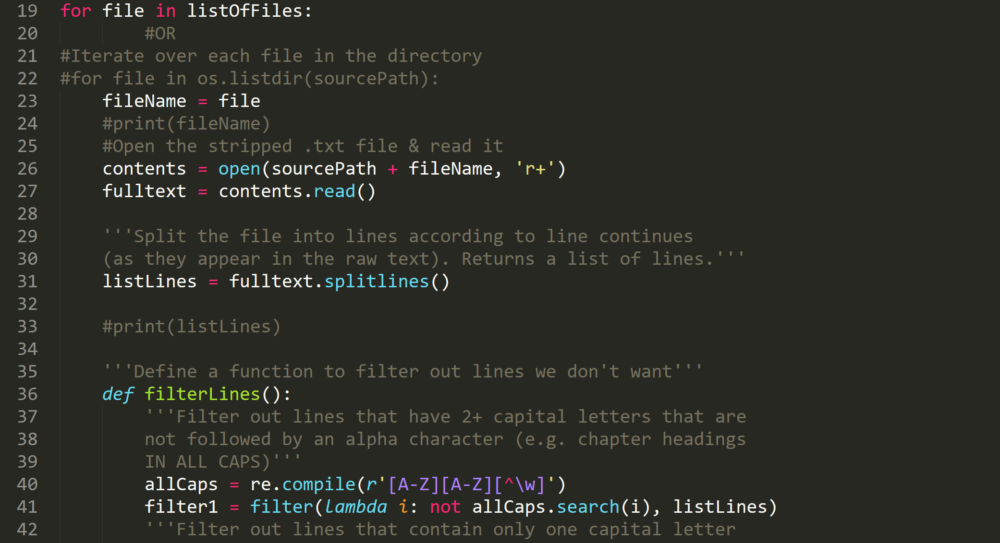

# Code



## Running the Scripts and Navigating Directories

This folder contains a number of Python scripts I used to prepare the corpus for modelling. As an overview, I followed these general steps to prepare the file:

1. Download the file into two locations: `samples/raw` and `samples/stripped`. The raw folder contains backup copies of the files (as they were when downloaded). (See ["Corpus"](../README.md#corpus) for more.)

2. In the `stripped` folder, open each file and remove all paratextual material—e.g.  copyright license, advertisements, and table of contents—that appears at the start or end of the file.

3. Once all the needed files have been stripped, run `cleanup.py`. `cleanup.py` reads every file and filters out unwanted lines and characters. Then it writes the results as one long string (i.e. without paragraph breaks or blank lines) in a file of the same name in the `oneString` folder. You can use `cleanup.py` for every .txt file in the folder or give it specific target files.

4. Run `mergeFiles.py` to create one long file by appending all the files in `oneString`, one after the other, with `merged.txt` as its output. You can also do this by copying and pasting the relevant code into `cleanup.py` and then cleaning up in the same step. merged.txt shouldn’t have any special characters such as & or ^ in it, or the next step will fail with an encoding error.

5. Begin the torch-rnn[ preprocessing steps](https://github.com/jcjohnson/torch-rnn#step-1-preprocess-the-data), then train and sample from the neural network.

Because the scripts are written in Python, they require downloading and installing Python to run. The scripts were written in Python 2.7. I have not tested them in other versions. See[ these instructions](https://en.wikibooks.org/wiki/A_Beginner%27s_Python_Tutorial/Installing_Python) for more on how to download and install Python. I designed and tested the scripts to run in[ Bash on Ubuntu on Windows 10](https://msdn.microsoft.com/en-us/commandline/wsl/about), a windows subsystem and interface that allows you to run command line code as if you had a Linux machine (if you have Windows, I highly recommend it since many of packages and instructions out there are written for the Linux command line anyway). Mac users can find a Linux command line with Terminal (Go to Applications/Utilities). If you want to run Python in the Windows command line, you will need to provide the file paths for Python like this:

```C:\Python27\python.exe C:\Users\Tiff\Documents\UVic\Classes\ENGL598\scripts\ cleanup.py```

Replace the second file path (C:…) with the file path to folder with the scripts in it.

To run the scripts, you will need to navigate to the scripts directory (i.e. the "scripts" folder). See[ this page](http://www.macworld.co.uk/feature/mac-software/how-use-terminal-on-mac-3608274/) for more on navigating directories in command line. The three commands you will need most often are (in Bash or Terminal):

```
cd [file path]/[name of folder] // change directory

ls // list all  files in current directory

cd .. // go up one level/directory
```

## The Scripts in More Detail

`cleanup.py` deletes extraneous symbols/characters (e.g. &#124;,\_) and filters out paratextual material such as chapter headings and blank/empty lines. It returns the .txt file in one long string to the samples/oneString folder. You can change the name/location of the source folder (the input or corpus/stripped by default) or the destination folder (the output or `corpus/oneString` by default).

```
cd authorFunction/code
python cleanup.py
```

`keepLines.py` does the same thing as above but preserves paragraph breaks and spacing. (More specifically, it stitches the lines back together after splitting them.)

`mergeFiles.py` iterates through every file in `corpus/oneString` and writes its contents into a single file, `merged.txt`. Also contains the option to select (a list of) specific files.

```
cd authorFunction/code

python mergeFiles.py
```

`cleanup2.py` is a version of cleanup.py that I originally used for some[ files from archive.org](https://archive.org/search.php?query=creator%3A%22Allen%2C+Grant%2C+1848-1899%22) but did not actually use for this project. I chose Gutenberg files because the Gutenberg transcriptions were more accurate; the files from archive.org were full of OCR errors. However, `cleanup2.py` has some filters to correct and normalize common OCR errors.