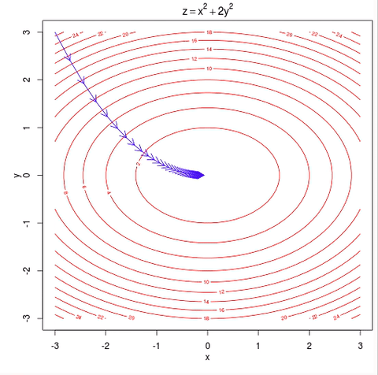
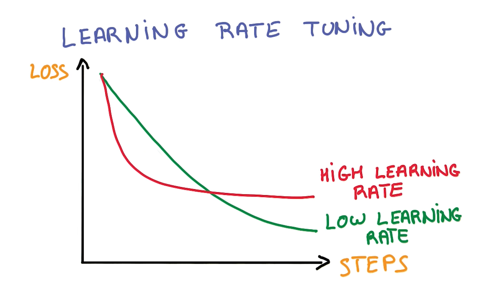

# Composition

## Getting Started

Running torch-rnn requires a number of dependencies that are all listed on the [torch-rnn page](https://github.com/jcjohnson/torch-rnn). You will need to install [Python](https://www.python.org/) and [Lua](https://www.lua.org/manual/5.3/readme.html) before installing [Torch](http://torch.ch/). Note that the commands listed there are meant to be entered into a Linux command line (see ["Getting to Know the Command Line"](https://www.davidbaumgold.com/tutorials/command-line/) by David Baumgold).

If you have Windows 10, I highly recommend using Bash on Ubuntu on Windows so that you can type in the commands as is. (There are [several](https://www.howtogeek.com/249966/how-to-install-and-use-the-linux-bash-shell-on-windows-10/) [tutorials](https://msdn.microsoft.com/en-us/commandline/wsl/install_guide) on the web that walk you through installation.) If you have older versions of Windows, consider upgrading or installing a shell such as [Cygwin](http://www.cygwin.com/), [Babun](https://babun.github.io/), or [win-bash](http://win-bash.sourceforge.net/). If you have a Mac, you can open the Terminal (command line interface) via Applications > Utilities > Terminal.

Installing and using a GPU (Graphics Processing Unit) is optional and you have to check if your computer meets the requirements first. A GPU would allow you to train your models much faster, although there are some options for increasing performance with a CPU only (see "Optimizing Hyper-parameters").

## Interface and Interpreting Results

Modelling and using a neural network consists of [three steps](https://github.com/jcjohnson/torch-rnn).

1. **Preprocessing**: running a Python script to prepare the data (a .txt file) for training.

2. **Training**: running a script to train a neural network on your data.

3. **Sampling**: once the neural network has been trained, you can generate samples of text based on what the network learned.

During all three steps, you can configure what are called [flags](https://github.com/jcjohnson/torch-rnn/blob/master/doc/flags.md) or hyper-parameters: settings you can use to tweak or optimize your model (see "Optimizing Hyper-parameters). You can get drastically different models by changing its hyper-parameters.

The goal of the training process is to minimize loss (a representation of the margin of error)—in particular validation loss, which represents the error or distance between the model's prediction and actual data. When sampling a checkpoint (see below), it is usually best to sample the checkpoint with the lowest validation loss (and hence your most accurate model).

Once you start the training process, you will see something like Fig. 7. From this interface, we can infer a number of characteristics.

*Figure 7: The interface for torch-rnn.*

**(Number of) Epoch(s):** An epoch is one full pass or cycle through the training data—i.e. your network has seen all of the samples once. The interface tells you the current epoch out of the total number of epochs (you can modify the total with the flag `--max_epochs`).

**Iteration(s):** The number of training iterations the model runs through, presented in the format current iteration / total iterations. The more complex your model, the more iterations it will need.

**Checkpoint:** Every 1000 iterations, torch-rnn saves a checkpoint from the model in the cv folder (e.g. `cv/checkpoint_10000.t7`). Once training is done, you pick a checkpoint at which to sample the model.

**Loss:** Loss represents the error rate for the model, so it follows the goal of training is to minimize loss as much as possible (see following section for tips on how to do that).

**Training Loss:** This number represents how well the model predicts the data it’s currently training on. The model prints training loss for every iteration.

**Validation Loss:** This number represents how well the model predicts data that was previously set aside before training (i.e. it is data that the model has never seen before). The model prints validation loss for the entire network every thousand iterations and may take a while to process.

## Optimizing Hyper-parameters

Although torch-rnn may make ANNs more accessible to non-specialists, optimizing the model (to produce legible text) can take a lot of time and trial-and-error. Neural networks like this one are "the ultimate ‘black boxes’ (Burger). Apart from defining the general architecture of a network and perhaps initially seeding it with a random numbers, the user has no other role than to feed it input and watch it train and await the output" (Burger).

However, there are ways to adjust the architecture of the network by using hyper-parameters ("parameters") in order to drive the loss down and produce a better model. We can use this [list of flags](https://github.com/jcjohnson/torch-rnn/blob/master/doc/flags.md) to modify the parameters. In the following, I discuss a number of tips for the training and sampling process that I’ve compiled and synthesized from different sources.

It can be helpful to train on smaller bits of information first (but at least 1 MB’s worth of data) to get a feel for how the parameters work before training larger models, which obviously take more time. It is also helpful in the beginning to abort models that aren’t working out well (`Ctrl/Cmd + z`) instead of letting the model run; that way you can test a different set of parameters more quickly.

### A Model’s "Fit": Training Loss vs. Validation Loss

As I said before, the goal of training is to minimize both types of loss, which should decrease over time as the model works its way through the data. If we were to plot the loss through time, it would initially decrease quickly and then gradually slow down as it approaches minimal loss. For more on general information on gradient descent, see [Tejani](https://alykhantejani.github.io/a-brief-introduction-to-gradient-descent/). See “Gradient Clipping” for more on how to adjust the gradient itself.

*FIGURE 8: Graph illustrating gradient descent as the arrow travels towards a minimum loss point. Animation care of Lijia Yu (http://vis.supstat.com/2013/03/gradient-descent-algorithm-with-r/)*

In practice, the gradient is not quite as smooth and can fluctuate even as the overall trend slopes downward. I would recommend copying and pasting the information printed at every checkpoint into a blank document so you can keep track of (training and validation) loss values and whether they are increasing or decreasing over time. This can be useful, not only for deciding which checkpoint you’d like to sample from later, but also to judge if a model is underfitting or overfitting by looking at the relationship between training and validation loss.

There are four possible scenarios:

1. If validation loss is consistently very similar or (almost equal) to training loss, your network may be **underfitting**: that is, your model is not predicting the training or validation data very well (see [Brownlee](https://machinelearningmastery.com/overfitting-and-underfitting-with-machine-learning-algorithms/) for more). To fix it, increase `-rnn_size` or `-num_layers` or even `-seq_length` (this will also increase the number of parameters)(Karpathy n.p.).

2. If training loss is consistently much lower than validation loss, the model is **overfitting**, meaning your model is learning "too well" and starting to memorize sequences instead of predicting them[Brownlee](https://machinelearningmastery.com/overfitting-and-underfitting-with-machine-learning-algorithms/). Overfitting actually makes the model’s prediction less accurate by introducing errors into your data (Brownlee). To fix it, you can decrease the model size (using `-rnn_size` or `-num_layers`), increase dropout (`-dropout`), or stop the model early (press Ctrl/Cmd + z in command line to abort commands). The latter is known as “early stopping” ([Bengio](https://arxiv.org/pdf/1206.5533.pdf)); [Perchelt]).

3. If validation loss is consistently slightly higher than your training loss (by around 0.1), then your model has a **good fit**.

4. If validation loss is consistently and significantly lower than your training loss and **the fit is unknown** ([cdeterman](https://stats.stackexchange.com/questions/187335/validation-error-less-than-training-error)). This is unusual because it means your model is predicting completely new information better than the information on which it’s trained. Increasing the size of the model seems to help.

As an overall strategy, Karpathy recommends deliberately overfitting a model and then using different dropout values to get a better fit ([Karpathy n.p.](https://github.com/karpathy/char-rnn)). I also find it helpful to keep track of the two loss values by copy-pasting them into a spreadsheet or a blank document. That way, it’s easier to see the overall trend at a glance even when there are smaller spikes or bumps.

### Changing the Rate of Descent: Learning Decay

As previously stated, the loss value can be plotted along a decreasing gradient. Torch-rnn allows you to adjust the gradient using the flags `-lr_decay_every`, `-lr_decay_factor,` and `-grad_clip` (see [torch-rnn flags](https://github.com/jcjohnson/torch-rnn/blob/master/doc/flags.md#training) for definitions and details). A common way to smooth the gradient is gradient clipping, which normalizes values that stray out of an accepted range (Grosse). If your loss fluctuates a lot, you can increase/adjust gradient clipping to decrease the bouncing.

`-lr_decay_every` and `-lr_decay_factor`affect the shape of the gradient. Increasing these numbers would make the gradient steeper while decreasing them will do the opposite. In practice, it is best to strike a balance between the two. Too steep and the loss will plateau and not decrease as much as it could have if the curve were more gradual; however, if the curve is too gradual or shallow, the model will take a lot of time to train (see Fig. 9)([Udacity](https://www.udacity.com/course/deep-learning--ud730)).

*Figure 9: Graph of different learning gradients and how loss changes over time. Image captured from a video by Udacity:(https://www.udacity.com/course/deep-learning--ud730).*

### Training Speed and Duration: Max Epochs, Batch Size, and Early Stopping

`-max_epochs` controls how many rounds or passes the network makes at the data. Larger values lengthen the training process. One common practice is to deliberately overfit the network but stop the training process just before the loss begins to increase again (i.e. stop the network before it becomes less accurate). We could do this by lowering `-max_epochs` to cut off the gradient at a particular place, or stop the training process manually.

`-batch_size` specifies the amount of data that is processed in parallel (i.e. simultaneously). Lower batch sizes can appear to radically increase computation speed, but it also increases the variance of the loss value—i.e. the loss value appears to bounce up and down even as it decreases (Bengio 9). As a consequence, it may take more iterations to decrease noticeably—which in turn can increase computation time. Speaking from personal experience, I still generally find it faster and better overall to go with a small batch size (5-10).

Early stopping refers to the practice of stopping or cutting off the training process before the network begins to overfit and lose accuracy (Bengio). If we chart the validation loss over time while overfitting, it would create a parobola-type shape; loss falls to a certain point and then begins to rise again as the network becomes too specific, losing its ability to generalize features to new data. With early stopping, we stop or cut off the training process at the sweet spot, where loss was the lowest, and sample from the corresponding checkpoint.

### Sequence Length

Sequence length specifies the number of steps back a network looks at (when going through backpropagation). At larger `-seq_length` values, the network will be able to find broader patterns across a string of characters where the current step might depend on a step much further back. Consider, for example, trying to predict the last word in "the clouds are in the *sky*" vs. “I grew up in France . . . I speak perfect *French*” ([Olah n.p.](http://colah.github.io/posts/2015-08-Understanding-LSTMs/)). Increasing `seq_length` will also increase the number of total iterations.

### Stopping and Starting Training

Training a network may take a lot of time (hours or, more likely, days). At any point, we can interrupt or abort the training process by typing `Cntrl/Cmd + z`. This can be particularly helpful when using the Early Stopping technique (see ["Training Speed and Duration"](#heading=h.3rdcrjn)); change parameters partway through; or if you want to shut down your computer or put it in standby/sleep mode. To (re)start the training process, use the `-init_from` flag and, optionally, the `reset iteration` tag.

## Works Cited

Bengio, Yoshua. "Practical Recommendations for Gradient-Based Training of Deep Architectures." *ArXiv.org.*, 16 Sept. 2012, https://arxiv.org/pdf/1206.5533.pdf

Brownlee, Jason. "Overfitting and Underfitting With Machine Learning Algorithms." *Machine Learning Mastery*, 21 Mar. 2016, https://machinelearningmastery.com/overfitting-and-underfitting-with-machine-learning-algorithms/

Burger, Josef. "A Basic Introduction To Neural Networks." 4 Nov. 2010, http://pages.cs.wisc.edu/~bolo/shipyard/neural/local.html

Grosse, Roger. "Lecture 15: Exploding and Vanishing Gradients." 29 Jul. 2016. http://www.cs.toronto.edu/~rgrosse/courses/csc321_2017/readings/L15%20Exploding%20and%20Vanishing%20Gradients.pdf

Karpathy, Andrej. "char-rnn," *Github.com*, 30 Apr. 2016, https://github.com/karpathy/char-rnn

Olah, Christopher. "Understanding LSTM Networks," *colah's blog*, 27 Aug. 2015, http://colah.github.io/posts/2015-08-Understanding-LSTMs/

Prechelt, Lutz. "Early Stopping—but When?", *Neural Networks: Tricks of the trade*, pp 55-69, Lecture Notes in Computer Science 1524, Springer Verlag, Heidelberg, 1998. http://page.mi.fu-berlin.de/prechelt/Biblio/stop_tricks1997.pdf

Tejani, Alykhan. "A Brief Introduction To Gradient Descent," *alykhantejani.com,* 1 Oct. 2016, https://alykhantejani.github.io/a-brief-introduction-to-gradient-descent/
