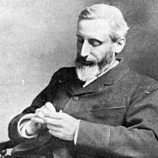
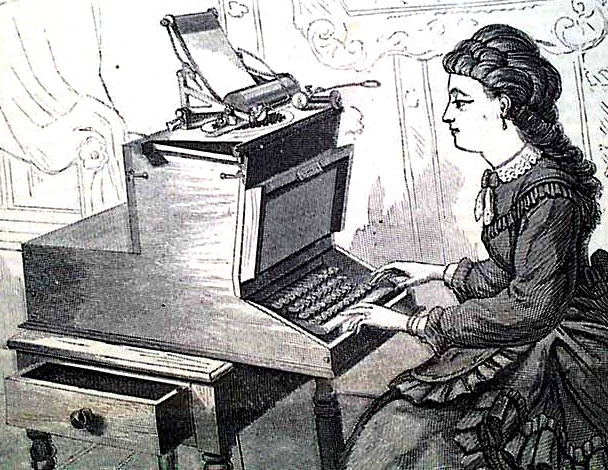
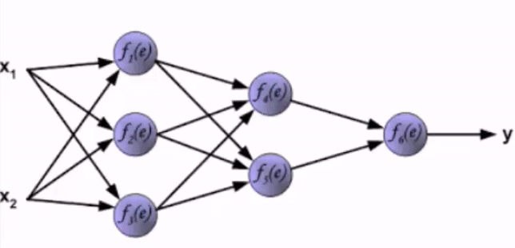
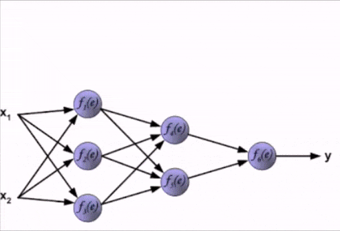

# Context

*Images: a portrait of Grant Allen (left), an illustration of a simple neural network's layers (centre), a typist typing with a Sholes typewriter (right)*

## The Anatomy of Neural Networks

This project uses [torch-rnn](https://github.com/jcjohnson/torch-rnn), a series of modules, written for the Torch framework by Justin Johnson and based on Andrej Karpathy’s [char-rnn](https://github.com/karpathy/char-rnn), that generates text using artificial neural networks ("ANNs"). ANNs are computer systems that loosely mimic the human brain. They consist of networks of neuron-like "nodes" that are grouped into layers, with nodes from one layer connected to nodes in other layers (see Fig. 1).

*Figure 1: Illustration of a neural network with arrows showing how information travels through it. Image made by Colin M. Burnett, care of Wikimedia Commons.*

Where we might typically expect a program or algorithm to execute a list of instructions sequentially or line-by-line, the nodes in an ANN fire simultaneously (in parallel) across the connections between nodes and/or between layers. Fig. 1 illustrates how this firing sequence, called “forward propagation,” works over time, making its way from the input layer, through intervening layers, until it reaches the final, output layer. The more numerous or dense the hidden layers, the larger, more complex, and more powerful the ANN.

To take a step back before forward propagation begins, the ANN sets a small portion of data aside called validation data (more on this later), and assigns a weight to each connection or synapse. (For its initial pass, the network uses a random value.) As input values move through the layers, the ANN multiplies them by the synaptic weights and then calculates the sum total activation (see Fig. 2).

*Figure 2: Animated GIF of forward propagation. Note the weight of each connection represented by W. Animation sampled from an animated GIF by Wil C.*

Forward propagation stops with the output layer. At this point, the ANN calculates the degree of error ("How wrong was I?") and then, in a process called backpropagation, the ANN goes backwards through the layers and adjusts the weight of each connection to produce better results the next time.  As the network cycles its way through the data, propagating forwards and backwards and adjusting the weights accordingly, it learns; that is, it improves its guesses by reducing or minimizing the error (the distance between its guess and the correct value) over time. With torch-rnn and other recurrent neural networks, the ANN learns, not only from its previous guess and its context (what comes before and after the target), but also from a whole history of previous guesses and their contexts. This learning process is called training a neural network (see Fig. 3).

*Figure 3: Animated GIF of one full cycle of activation, including forward propagation and backpropagation. Animation sampled from a GIF by Wil C.*

Once the training process is complete, we can ask a trained ANN to generate a novel sequence—that is, to "sample" from the network—by running in forward propagation mode only, using the weights it learned while training.

## Enter torch-rnn

In May 2015, Andrej Karpathy published ["The Unreasonable Effectiveness of Recurrent Neural Networks"](http://karpathy.github.io/2015/05/21/rnn-effectiveness/) and made [the accompanying code](https://github.com/karpathy/char-rnn) free and available online. Like its name suggests, char-rnn allows you to train an ANN on a corpus of your choosing and then generate novel text character by character, in two-character sets. Since then, many others have adapted Karpathy's code or method for their own projects (e.g. Ross Goodwin's work in ["Narrated Reality"](https://medium.com/artists-and-machine-intelligence/adventures-in-narrated-reality-6516ff395ba3), Lars Hiller Eidnes' [word-rnn](https://github.com/larspars/word-rnn), Aaron Ng's [Netflix synposis generator](https://medium.com/aaronn/generating-netflix-synopses-with-a-recurrent-neural-network-e8aef791fdce)).

One such project is torch-rnn, an improved version of char-rnn that I adopted for my own project. Like char-rnn, torch-rnn allows us to create, train, and sample ANNs on personal computers without advanced knowledge or formal training in Computer Science or statistics. Instead, we can adjust a [list of hyper-parameters](https://github.com/jcjohnson/torch-rnn/blob/master/doc/flags.md) (see “Optimizing Hyper-parameters”) or flags to be used by the ANN when preprocessing, training, or sampling from the network.

More specifically for this project, torch-rnn lets me imitate Grant Allen’s “style” (as calculated by the ANN) by training it on selected works available at [Project Gutenberg](http://onlinebooks.library.upenn.edu/webbin/gutbook/author?name=Allen%2C%20Grant%2C%201848-1899) (see the [“Corpus” folder](corpus) for more). I then sample from the model to produce novel text (see Fig. 4)—text that Allen did not write but, hypothetically- and statistically-speaking, could have.

Sample 1	               |  Sample 2
:-------------------------:|:-------------------------:
  | 

Sample 3				   |    Sample 4
:-------------------------:|:-------------------------:
  | 

*Fig 6: Pictures of samples at different points in the model and what they produce*

## Grant Allen: a Case Study

Grant Allen (1848-1899) was an author who wrote in many different genres and disciplines; he wrote both fiction (e.g. short stories, novels) and non-fiction (e.g. essays, scientific articles, travel guides). In 1876, he began writing professionally and published short stories under pen names such as J. Arbuthnot Wilson and Cecil Power ("Grant Allen"). He also published *The Type-writer Girl* (1897) and *Rosalba* (1899) under a cross-gendered pseudonym, Olive Pratt Rayner ("Grant Allen"). He was an extremely productive writer, writing more than thirty works of fiction in fifteen years with *The Woman who Did*(1895) becoming his most popular and lucrative achievement ("Grant Allen"). *The Woman Who Did* depicts a young woman who struggles against gender conventions,  is generally read as sympathetic to women's rights and emancipation. It attracted as much criticism and satire as it did fame or admiration: for example, *Punch*, a popular and well-known satiric magazine, even turned "The Woman Who..." into a catchphrase (Warne and Colligan 21-22).

In the latter half of the nineteenth century, Allen witnessed many changes in literary production and circulation. Automation and technological innovations increased the sheer volume of print material while lowering costs. At the same time, social changes such as strong emphasis on education and the rising middle-class meant that this print material could reach far broader audiences than before. But although technological advances and decreasing costs may have made nineteenth-century books literature more accessible, they did not solve cultural debate about who counts as an author and what counts as "authentic" literature. 

### The Anxiety of Authorship

Allen makes an interesting case study for machine learning and studies of authorship and style because, throughout his life and career, he was very self-conscious and concerned with his own authorial identity and writing personae. Not only did he write under at least three pseudonyms on several occasions ("Grant Allen"), he also went to great lengths to create a backstory for "Olive Pratt Rayner" ("Literary Notes"); wrote a dedication to her fictional husband and brother(Allen ); and insisted that no one know his identity as author until after his death ("News in Brief"). Furthermore, Vanessa Warne and Colette Colligan suggest that Allen's use of a cross-gender pseudonym and other writings reflect anxieties over writing as a male author in a genre with a largely female audience.

*The Type-writer Girl* also troubles any neat categorization of gender through multiple layers of imitation. For example, Allen's use of a cross-gendered pseudonym might expose the instability of gender roles or binaries—that is, their susceptibility to being faked—even as it can indicate a desire to follow convention (e.g. the convention of female writers writing for a female market). Perhaps more subtly, the female protagonist creates a double disguise (see Cameron): Allen is writing as a woman writing (in first-person) as a female character. And, as Cameron notes, it is possible that a reader might assume Rayner was writing from personal experience, giving the work an air of authenticity (236). Using machine learning to imitate Allen's style may echo Allen's own gender imitations or personae in his writing.

*The Type-writer Girl*—written for a female audience and which Allen wrote as Rayner—thematically foregrounds issues of gender, authorship, and authenticity. Somewhat like Allen himself, the novel's protagonist, Juliet Appleton, struggles to write original, creative literature while working as a typist, mindlessly transcribing and copying the words of her male boss. In Appleton, the novel presents a figure for women's emancipation: a woman who is educated, talented, and has financial independence. Appleton's profession alludes to female labour and contributions to textual and literary production that are generally overlooked. In Allen's time, the labour of reproduction or duplication was gendered female and held a much lower status than the work of a masculine, original, and creative mind (Keep; Plant; Wosk). A typist or copyist worked for financial gain while a genius pursued an artistic vision; a genius creates and innovates while a hack merely imitates what has been done before.

### Queer Writing Machines

We could link Allen's imitation to the imitation games of early AI from the 1950s on or, more explicitly, the concept of machines covincingly imitating humans—he most famous example of the latter being "the Turing test." Many people know the Turing test as an imitation game in which a human interlocutor converses with two participants: one is a human while the other is an AI imitating a human. If the AI is able to convince the interlocutor, the AI is said to pass the Turing test. It is perhaps fitting, then, to imitate Allen’s writing using a neural network that (albeit very loosely) imitates the workings of a human brain. Furthermore, what often escapes notice is that Turing's original test, as he described it, is explicitly about gender imitation rather than the imitation of a (supposedly) universal human essence. In fact, for an AI to pass Turing's original imitation game, it would have to convincingly imitate a man imitating a woman (n.p.). Like Allen's imitation, Turing's imitation game is couched in the imitation of gender specifically, suggesting that intelligence, whether human or artificial, cannot exist outside of or divorced from cultural concerns such as gender.

Late twentieth-century anxieties that AI will replace humans ("Now even poets will be out of a job") might strangely echo nineteenth-century anxieties over the decline of handcraft or reactions against automation and mechanical reproduction (e.g. Ludditism, the Arts and Craft Movement). However, then as now, new or mass-market technologies did not straightorwardly or completely replace craft so much as it morphs or develops in response to them (Adamson iv). Similarly, as Ross Goodwin argues, machine learning and other forms of generative art do not replace humans; instead, they offer more, not less, affordances, spaces, and techniques for composition (n.p.).

## Possible Future Directions

Like *The Woman who Did*, much of Allen’s work deals with themes of gender and female emancipation in particular. For example, *The Type-writer Girl* features a headstrong female protagonist who is determined to support herself financially and chooses not to marry in spite of her love interest’s affections. (NOTE:  Cite The Type-writer Girl, broadview) However, Allen’s own gender politics are both controversial and contested in current scholarship. Although he wrote explicitly in support of women’s rights and independence, many scholars note that he seemed unable to reconcile this with his Darwinist emphasis on reproduction and motherhood (Allen anthology, Cameron). If we use a neural network and train it on his writing, we could produce text that Grant Allen never wrote but *theoretically could have*. As a kind of speculative exercise, (Krauss; Rosner; Samuels and McGann) we could then interpret this artificially-produced text as if it were the original. By itself or through comparative analysis with the original, this process might tell us something new about gender politics in the late nineteenth century that we might not have learned otherwise.

Furthermore, we might link the Author Function's gender imitation to gender performativity. First coined by Judith Butler, performativity refers to the coerced repetition or performance of a gender ideal that is never realized as authentic, despite all attempts. Similarly, my project also functions as a kind of imitation without an original: it automates the performance of authorship in search of novel conceptions of gender that congeal over time and through repetition, rather than seek to uncover what Grant Allen personally "really meant." Although a full discussion of gender is outside the scope of this project, it’s worth considering how this project might productively speak to forgotten queer histories of computing.

Lastly, neural networks, as a medium or methodology, are relatively opaque when compared to other kinds of programming. Although someone designs the general architecture of a model (via parameters), they do not have explicit control once the training process starts and can’t see the results until the training process has ended. Neural networks are unique in this. Where we might normally expect a program to execute a specific set of instructions to produce a deterministic output, the "output" of a neural network is the model itself—which in turn becomes a platform for generating its own outputs (Berger n.p.). Placed alongside other forms of generative writing, this project also invokes an “aesthetic of surprise” that emerges when designers confront, or concede, an absence of control. (Howe and Soderman n.p.) In this project, I tried to walk the line between surprise (what is unexpected) and coherence (what is legible). In this way, imitation exceeds rote repetition and becomes a creative endeavour in and of itself. In other words, imitation demands some measure of originality—some might even say authenticity—even as it passes as a convincing duplicate of something else.

## Works Cited

Adamson, Glenn. Intoduction. *The Craft Reader*. Berg, 2010.

Allen, Grant. Introduction. *The British Barbarians: a Hilltop Novel*. G. P. Putnam & Sons, 1895. https://archive.org/stream/britishbarbarian00allerich#page/n13/mode/2up

Allen, Grant. *The Type-writer Girl.* C. Arthur Pearson, 1897. https://archive.org/stream/cihm_05084#page/n5/mode/2up

Cameron, S. Brooke. “Sister of the Type: the Feminist Collective in Grant Allen’s The Type-writer Girl.” *Victorian Literature and Culture*, no. 40, 2012, pp. 229-244.

"(Charles) Grant Blairfindie Allen (1848-1899)." Cotton, J.S. and rev. Rosemary T. Van Arsdel. *Oxford Dictionary of National Biography*, Oxford University Press, 2004; online edn, April 2016. (http://www.oxforddnb.com.ezproxy.library.uvic.ca/view/article/373)

Goodwin, Ross. “Adventures in Narrated Reality: New forms & interfaces for written language, enabled by machine intelligence.” *Artists and Machine Intelligence*, *Medium.com*, www.medium.com/artists-and-machine-intelligence/adventures-in-narrated-reality-6516ff395ba3

Howe, Daniel C. and A. Braxton Soderman. “The Aesthetics of Generative Literature: Lessons from a Digital Writing Workshop.” *Hyperrhiz*, no. 6, Fall 2009. Edited by Dene Grigar. www.hyperrhiz.io/hyperrhiz06/essays/the-aesthetics-of-generative-literature-lessons-from-a-digital-writing-workshop.html

Keep, Christopher. “The Cultural Work of the Type-Writer Girl.” *Victorian Studies*, vol. 40, no. 3, 1997, pp. 401-425.

Kraus, Kari. “Conjectural Criticism: Computing Past and Future Texts.” *Digital Humanities Quarterly*, vol. 3, no. 4, 2009, n.p.

"Literary Notes." *The Australasian* [Melbourne, Australia], 16 Dec. 1899, issue 1759, p. 1402.

"News in Brief." *The Evening News* [Portsmouth, England], 27 Oct. 1899, issue 6981, p. 2.

Plant, Sadie. *Zeroes and Ones: Digital Women and the New Technoculture*. Fourth Estate, 1997.

Samuels, Lisa and Jerome McGann. “Deformance and Interpretation.” *New Literary History*, vol. 30, no. 1, 1999, pp. 25-26.

Turing, Alan. “Computing Machinery and Human Intelligence.” *Mind*, no. 59, 1950, pp.433-460, www.loebner.net/Prizef/TuringArticle.html

Wosk, Julie. Women and the Machine: Representations from the Spinning Wheel to the Electronic Age. John Hopkins UP, 2001.