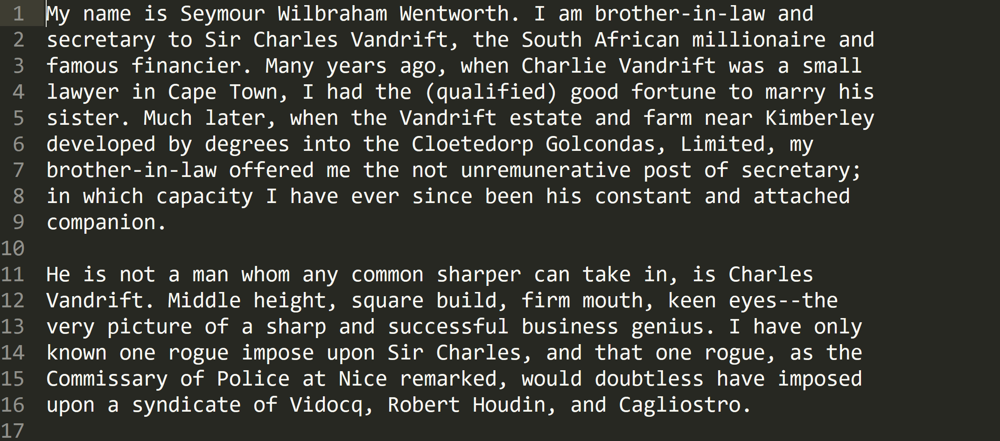

## Corpus

*Image of a file in the corpus.*

This corpus consists of 31 .txt files downloaded from[ this Project Gutenberg page](http://onlinebooks.library.upenn.edu/webbin/gutbook/author?name=Allen%2C%20Grant%2C%201848-1899) compiled by[ the Online Books Page and John Mark Ockerbloom](http://onlinebooks.library.upenn.edu/). I chose the Gutenberg files for their availability and accurate transcriptions. I chose only single-author books and did not include Allen’s travel guides.

The corpus is organized into three different folders: "raw" (the state they were when downloaded), "stripped" (devoid of paratextual material), and “oneString” (rewritten into one long sequence of characters without line breaks or carriage returns). See ["Code"](../code) for more information on how the files and folders relate to each other or their context of use.