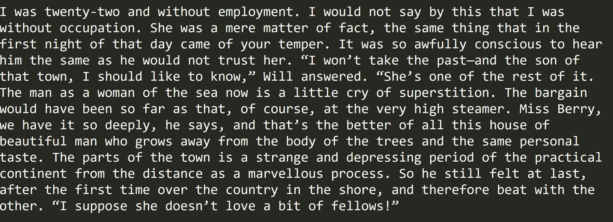

# The Author Function: Imitating Grant Allen with Queer Writing Machines

"I cannot choose but wonder who each is, and why he is here. For one after another I invent a story. It may not be the true story, but at least it amuses me." — Grant Allen, [*The Type-writer Girl*](https://archive.org/details/cihm_05084)

This repository contains files for "The Author Function": a project that uses machine learning to imitate the style of Grant Allen (1848-1899), a nineteenth-century author who wrote in a variety of genres and under various pseudonyms. To imitate Allen's writing style, I used artificial neural networks (ANNs), which are modelled loosely on the structure and behaviour of human brains. Specifically, I used the code module [torch-rnn](https://github.com/jcjohnson/torch-rnn), written by Justin Johnson, to "train" an ANN on Allen's writing. Unlike more conventional programming, ANNs do not use explicit or hand-coded instructions to produce a determined output. Instead, the output is the ANN or model itself (see ["Anatomy"](#the-anatomy-of-neural-networks) for more) ([Burger 2010](http://pages.cs.wisc.edu/~bolo/shipyard/neural/local.html)). After training, I "sample" the network to generate novel strings of text based on the training data's unique stylistic features (as learned by the ANN).

This project takes its name and inspiration from [Foucault's concept](http://www.english.upenn.edu/~cavitch/pdf-library/Foucault_Author.pdf) of the author as not a single person, but rather the effect of material and cultural influences that combine and congeal into what we consider authorship to be. Foucault refers to these effects as mathematical functions and processes that serve a political utility. I take this function to an extreme by transforming Grant Allen's style into an executable computer function—a procedure used to express, calculate, and manipulate values.

In practice and purpose, this project resembles generative or "computational creative writing" ([Goodwin 2016](https://medium.com/artists-and-machine-intelligence/adventures-in-narrated-reality-6516ff395ba3)), such as Twitter bots ([Goodwin 2016](https://medium.com/artists-and-machine-intelligence/adventures-in-narrated-reality-6516ff395ba3);[ Kazemi n.d.](http://tinysubversions.com/);[ Parrish n.d.](http://www.decontextualize.com);[ Sample 2014](https://medium.com/@samplereality/a-protest-bot-is-a-bot-so-specific-you-cant-mistake-it-for-bullshit-90fe10b7fbaa);[ Sloan 2016](https://www.robinsloan.com/notes/writing-with-the-machine/)). These creative practices disarticulate written text or language into component parts before rearranging and recombining them in disarming or unfamiliar formations. My goal, however, is not to prove whether a computer *can or cannot* convincingly "pass” as Grant Allen. Instead, I am more interested in what Allen *could* have written. I also believe that computational conjecture enriches creative writing. As [Robin Sloan](https://www.robinsloan.com/notes/writing-with-the-machine/) describes writing with machines,

>The animating ideas here are augmentation; partnership; call and response.
>
>The goal is not to make writing "easier"; it’s to make it harder.
>
>The goal is not to make the resulting text “better”; it’s to make it different — weirder, with effects maybe not available by other means.

Computational creative writing poses questions, challenges, and possibilities that we may not have otherwise considered. For example, what can we learn from or about two hallmarks of generative literature, namely absurdity and surprise ([Howe and Solderman 2009](http://hyperrhiz.io/hyperrhiz06/essays/the-aesthetics-of-generative-literature-lessons-from-a-digital-writing-workshop.html))? What would we consider an optimal model or sample text and according to what criteria? If we juxtapose these new combinations with what Allen actually wrote, what can we learn about Allen’s prose and politics that we didn’t know before?

Allen makes an interesting case study for performative authorship. In recent years, contemporary scholars have revisited his life and work. They discuss the clash between Allen's political and artistic aspirations, and how market pressures greatly influenced not only what he wrote, but how he situated or presented himself in relation to his writing (Greenslade and Rodgers 2005; Morton 2005; Warne and Colligan 2005). He lamented how the economic necessity of churning out copy prevented him from expressing the "truth and righteousness...of [his] own original thinking" ([*The British Barbarian*](https://archive.org/stream/britishbarbarian00allerich#page/n15/mode/2up) 1895, xii-xiii). As Allen puts it, “When I wished to purvey strong meat for men, I was condemned to provide milk for babes” (xi).

Allen’s assertion above is noteworthy for two reasons. First, he discriminates between the work of an original genius and the conventional or derivative work of the hack (Price 2005). Second, Allen genders both types of work and their respective audiences: he codes the former as masculine and the latter as feminine. What a male genius creates, the female copyist duplicates. In context, Allen’s attitude is not unusual; scholars who study the nineteenth century readily discuss such gender distinctions (Keep 1997; Plant 1997; Price 2005; Wosk 2001). What sets Allen apart, however, is his decision to use a female pseudonym (Olive Pratt Rayner) when publishing *The Type-writer Girl* (1897) for the female readership of New Woman fiction (Warne and Colligan 23). Casting Allen as a case study yields new insight into the politics, culture, and aesthetics of imitation work and its relationship to gender. It seems fitting, then, to imitate Allen—himself a writer of "copy"—with a machine.

Allen’s gender imitation prefigures later imitation games with artificial intelligence (AI), such as the Turing test first described by Alan Turing in 1950 (n.p.). Both point to the potentials and perils of disguising or performing gender that in turn prove the elasticity of gender and sexuality categories (Foster 2005, 112-114; Halberstam 1991). This attempt to queer artificial intelligence parallels practices and methods of "queer computing," which refuses impulses towards progress (e.g. product innovation) or hyperproductivity (e.g. [the “quantified self” movement](http://www.economist.com/node/21548493)) ([Blas 2012](http://www.zachblas.info/works/queer-technologies/); Gaboury 2018). Queer computing privileges multiple forms and “failures” over a single, stable ideal (Gaboury 2018, 487). It also embraces indeterminacy rather than positivism (Haber 2016, 151). In these respects, “The Author Function” operates as a queer writing machine: by extrapolating and creating even more text(s), it releases possibilities of meaning rather than seeks to prove exactly “what Allen *really* meant.” Furthermore, it renders visible the underlying logics and values of categories (e.g. gender and sexuality) to critique rather than enforce them.

"The Author Function" is a modest first step in a larger project of exploring the possibilities of machine learning and imitation in/for cultural and literary research. It draws from work by [Kari Kraus](http://www.digitalhumanities.org/dhq/vol/3/4/000069/000069.html) on subjunctive practice and [Lisa Samuels and Jerome McGann](https://search.proquest.com/docview/1297362478?pq-origsite=gscholar) on systematic alterations of texts. In their research, these scholars emphasize the potential of speculation: what could we learn about our object of inquiry (in this case, literature) if we broke down, remade, and compared or interpreted it either alongside or as if it were the original? Articulated in Victorian terms, this project is like conducting a séance with a computer instead of a Ouija board. The computer mediates between human and machine, between the dead and the living. If, as Stephen Greenblatt suggests, literary study begins with "the desire to speak with the dead" (1988, 1), then “The Author Function” begins by impelling the dead to speak. This project is not only an experiment in literary imitation; it is also a work of imagination, forged with and through literary and linguistic codes. Ultimately, “The Author Function” asks what happens if we reanimate an author with a queer machine—and what might this machine say?

## Acknowledgements

First, I acknowledge that I created this project on the traditional territories of the Songhees, Esquimalt, and WSÁNEĆ peoples, whose historical relationships and stewardship of the land continues to this day. My growth as a scholar and a person would not have been possible without the land on which I have studied, worked, and lived for the past three years. I am also grateful to Dr. Jentery Sayers, who has mentored and supported me from the very first days of my Master's. I couldn't imagine my graduate career without the formative experiences of working with the MLab and all the fruitful conversations that have emerged from it. Thanks to Dr. Mary Elizabeth Leighton for her support, especially in the early stages of my research and writing process, and for pulling me out of difficult spots when needed. And lastly, a very heartfelt thank you to all the cherished friends and fellow scholars who have helped me through a very rough year. I could not have done it without you.

## Version

This is version 1.1 of The Author Function.

## License

<a rel="license" href="http://creativecommons.org/licenses/by-nc-sa/4.0/"></a><br/></a>This work is licensed under a <a rel="license" href="http://creativecommons.org/licenses/by-nc-sa/4.0/">Creative Commons Attribution-NonCommercial-ShareAlike 4.0 International License</a>.

---

## Table of Contents

### Context
* [The Anatomy of Neural Networks](#the-anatomy-of-neural-networks)
  * [Enter torch-rnn](#enter-torch-rnn)
* [Grant Allen](#grant-allen)
  * [The Anxiety of Authorship](#the-anxiety-of-authorship)
  * [Queer Writing Machines](#queer-writing-machines)

### Composition
* [Getting Started](#getting-started)
* [Python Code](#python-code)
  * [Running the Scripts and Navigating Directories](#running-the-scripts-and-navigating-directories)
  * [The Scripts in More Detail](#the-scripts-in-more-detail)
* [Interface and Interpretation](#interface-and-interpretation)
* [Optimizing Hyper-parameters](#optimizing-hyper-parameters)
  * [A Model's Fit: Training vs. Validation Loss](#a-models-fit-training-loss-vs-validation-loss)
  * [Changing the Rate of Descent: Learning Decay](#changing-the-rate-of-descent-learning-decay)
  * [Training Speed and Duration: Max Epochs, Batch Size, and Early Stopping](#training-speed-and-duration-max-epochs-batch-size-and-early-stopping)
  * [Sequence Length](#sequence-length)
  * [Stopping and Starting Training](#stopping-and-starting-training)
  * [Sampling](#sampling)
* [Corpus](#corpus)

### Conclusions
* [Findings](#findings)
* [Future Directions](#future-directions)

### Works Cited

[Sources and further reading](#works-cited-1)

---

## Context


*Images: a portrait of Grant Allen (left), an illustration of a simple neural network's layers (centre), a typist typing with a Sholes typewriter (right)*

### The Anatomy of Neural Networks

This project uses [torch-rnn](https://github.com/jcjohnson/torch-rnn), a series of modules written for the Torch framework by Justin Johnson and based on Andrej Karpathy’s [char-rnn](https://github.com/karpathy/char-rnn) that generates text using artificial neural networks ("ANNs"). ANNs, which are loosely inspired by biological neural networks, consist of nodes that are grouped into layers, with nodes from one layer connected to other layers (see Figure 1).


*Figure 1: Illustration of a neural network with arrows showing how information travels through it. Image by Colin M. Burnett, care of Wikimedia Commons.*

Whereas we might typically expect a program or algorithm to execute a list of instructions sequentially or line by line, the nodes in an ANN fire simultaneously (in parallel) across the connections between nodes and/or between layers. Figure 1 illustrates how this firing sequence, called "forward propagation," works over time, making its way from the input layer, through intervening layers, until it reaches the final, output layer. The more numerous or dense the hidden layers, the larger, more complex, and more powerful the ANN.

Before forward propagation begins, the ANN sets aside some "validation data" (more on this later) and assigns a weight to each connection or synapse. (For its initial pass, the network uses a random value.) As input values move through the layers, the ANN multiplies them by the synaptic weights and then calculates the sum total activation (see Figure 2).


*Figure 2: Animated GIF of forward propagation. Note the weight of each connection represented by W. Animation sampled from an animated GIF by Wil C.*

Forward propagation stops with the output layer. At this point, the ANN calculates the degree of error and then, in a process called "backpropagation," goes backwards through the layers and adjusts the weight of each connection to produce better results the next time. The network learns as it cycles through the data, propagating forwards and backwards and adjusting the weights accordingly. It improves its guesses by reducing or minimizing the error (the distance between its guess and the correct value) over time. With torch-rnn and other recurrent neural networks, the ANN learns from not only its previous guess and context (what comes before and after the target) but also a history of previous guesses and their contexts. This learning process is called “training” a neural network (see Figure 3).


*Figure 3: Animated GIF of one full cycle of activation, including forward propagation and backpropagation. Animation sampled from a GIF by Wil C.*

Once the training process is complete, we can ask a trained ANN to generate a novel sequence—that is, to "sample" from the network—by running in forward propagation mode only, using the weights it learned while training.

#### Enter torch-rnn

In May 2015, Andrej Karpathy published[ "The Unreasonable Effectiveness of Recurrent Neural Networks"](http://karpathy.github.io/2015/05/21/rnn-effectiveness/) and [the accompanying code](https://github.com/karpathy/char-rnn) online. Like its name suggests, char-rnn allows you to train an ANN on a corpus of your choosing and then generate novel text character by character, in two-character sets. Many others have adapted Karpathy's code or method for their own projects (e.g. Ross Goodwin's ["Narrated Reality"](https://medium.com/artists-and-machine-intelligence/adventures-in-narrated-reality-6516ff395ba3) project, Lars Hiller Eidnes'[ word-rnn](https://github.com/larspars/word-rnn), and Aaron Ng's[ Netflix synopsis generator](https://medium.com/aaronn/generating-netflix-synopses-with-a-recurrent-neural-network-e8aef791fdce)).

One such project is torch-rnn, a more efficient version of char-rnn that I adopted for "The Author Function." Like char-rnn, torch-rnn allows us to create, train, and sample ANNs on personal computers without advanced knowledge or formal training in Computer Science or statistics. Instead, we can adjust a list of settings, called flags or “hyper-parameters” (see[ “Optimizing Hyper-parameters”](https://github.com/jcjohnson/torch-rnn/blob/master/doc/flags.md)), to be used by the ANN when preprocessing, training, or sampling from the network.

Simply put, torch-rnn lets us imitate Grant Allen’s style (as calculated by the ANN) by training it on selected works available at [Project Gutenberg](http://onlinebooks.library.upenn.edu/webbin/gutbook/author?name=Allen%2C%20Grant%2C%201848-1899) (see the "Corpus" folder for more). I then sample from the model to produce novel text (see Figure 4)—text that Allen did not write but could have (for more samples, see the Code subfolder).

*Figure 4: Pictures of samples written by the model, which has been fed the same two starting sentences in each case.*

*Sample 1*


*Sample 2*


*Sample 3*



*Sample 4*


### Grant Allen

Grant Allen (1848-1899) wrote short stories, novels, essays, scientific articles, and travel guides. He also published short stories under pen names such as J. Arbuthnot Wilson and Cecil Power, along with two novels, *The Type-writer Girl* (1897) and *Rosalba* (1899), under a cross-gendered pseudonym, Olive Pratt Rayner (Cotton and Van Arsdel 2004, n.p.). An extremely productive writer, he wrote more than thirty works of fiction in fifteen years (n.p.). His most popular and lucrative achievement, *The Woman Who Did* depicts a young woman who struggles against gender conventions and refuses to marry based on her feminist objections to the institution of marriage. Although it could be read as sympathetic to women’s rights and emancipation, it attracted as much criticism and satire as it did popularity or economic success. For example, *Punch*, a popular and well-known satirical magazine, turned "The Woman Who..." into a catchphrase (Warne and Colligan 2005, 21-22).

In the latter half of the nineteenth century, Allen witnessed many social changes in literary production and circulation. Automation and technological innovations increased the sheer volume of print material while lowering costs. At the same time, cultural changes, such as strong emphasis on education and the rising middle class, meant that print material could reach far broader audiences than before. Although technological advances and decreasing costs made nineteenth-century books more accessible, they did not resolve cultural debates about who counts as an author and what counts as literature.

### The Anxiety of Authorship


Throughout his life and career, Allen was very self-conscious about and concerned with his own authorial identity and the performance thereof. Not only did he write under at least three pseudonyms on several occasions (Cotton and Van Arsdel 2004, n.p.), he also goes to great lengths to create a backstory for "Olive Pratt Rayner" ("Literary Notes"); dedicates "her" novels to a fictional husband and brother (Allen 7); and insists that no one know his identity as author until after his death ("News in Brief"). Vanessa Warne and Colette Colligan suggest that Allen's use of a cross-gender pseudonym and other writings reflect anxieties over writing as a male author in a genre with a mostly female audience.


*Figure 5: An posthumous note in* The Australasian *about "Olive Pratt Rayner."*

Allen’s cross-gendered pseudonym suggests that an author’s gender, as read or interpreted by their audience, is susceptible to being faked. In the context of performance and performativity, Allen’s cross-genderism recalls Butler’s reading of drag, which "plays upon the distinction between the anatomy of the performer and the gender that is being performed" to expose the instability of gender as a natural or essential characteristic (1999, 175). Allen’s pseudonym might well raise the same point, even if, in other respects, his politics seem problematic. For example, although Allen wrote explicitly in support of women’s rights and independence, many scholars note that he seemed unable to reconcile this support with his Darwinist emphasis on reproduction and motherhood (Atchison 2005; Cameron 2012).

Furthermore, Allen—like *The Type-writer Girl*’s protagonist, Juliet Appleton—struggled to write original, creative literature rather than merely churning out "copy" (for Appleton, this would be literal copies) in order to make a living (*The British Barbarians* 1895, vii-ix). In Allen’s time, or indeed even now, each type of work was also gendered. Starting as early as the 1870s, the latter half of the nineteenth century saw a boom in dictation and secretarial work, of the kind in which Appleton participates, and in in mechanical reproduction. Not only was the labour of reproduction (i.e. writing copies of texts or transcribing them) or duplication gendered female (Keep 1997, 401-403; Price 2005, 129), it was also separated from and held in lower esteem than the creative, intellectual labour of “true” authorship (Keep 1997; Plant 1997). Consider, for example, the case of Theodora Bosanquet (see Bosanquet in the [Works Cited](#works-cited-1)), who was previously known merely as one of Henry James’ secretaries, and whose creative contributions and rich intellectual life previously drew little attention (Thurschwell 1999). (For more on the subject of women as communication or literary mediaries, see Chun 2011; Galvan 2010; Price and Thurschwell 2005.) By this logic, a male author pursues an artistic vision while a female typist or copyist works for financial gain; a genius creates while a hack merely imitates.

Allen’s struggle to be taken seriously as a creative author rather than a hack (Morton 2005; Price 2005; Warne and Colligan 2005) puts him in a peculiar position vis-à-vis gender and labour. Although he identifies as a male author, the gender dynamics of nineteenth-century textual (re)production cast his work as feminine. Moreover, as Leah Price notes, Allen’s role in demonstrating the capabilities of a typewriter—of which he was one of the first early adopters—might also align him with other notable demonstrators: women that typewriter companies relied on to advertise and market their products (see Figure 6). Not quite masculine and yet not quite feminine, Allen inhabits a queer liminal position between the two.


*Figure 6: Lillian Sholes, with one of her father's (Christopher Latham Sholes') experimental typewriters (ca. 1872). Image information from Wosk (p. 24), image care of the University of Wisconsin Digital Collections Center.*

### Queer Writing Machines

The rise of female secretarial work and mechanical reproduction in the last two decades of the nineteenth century accompanies a linguistic shift as well: as Price notes, "Until well into the twentieth century, a ‘type-writer’ could refer to the worker as easily as to her machine" (134). Allen’s own literary hack work, which aligned him with “clerical wage slaves” rather than true artists, suggests a similar conflation (137). The *Type-writer Girl* seems to be composed “on a typewriter, about a typewriter, and ostensibly by a typewriter” (138).

Allen’s extraordinary literary output made him something of a spectacle. As biographer Richard Le Gallienne writes about him,

>In the merely mechanical—but how important—matter of "turning out" his “copy”
>he was quite amazing. Anyone who stayed in his house will remember how his
>typewriter could be heard, as you crossed the hall, punctually beginning to
>click at nine every morning and, if you eavesdropped, you would seldom note a
>pause in its rapid clicking. (204)

Although Allen does not embody or inhabit the position of a woman in this context, he does at least test the elasticity of such gender categories. Furthermore, Allen's own struggle to assert his originality despite churning out his "'copy'"—the very same struggle Juliet Appleton grapples with in *The Type-writer Girl*—might have highlighted both the plight and lowered status of textual reproduction. Although it may not have been his intention, Allen’s work and performances of authorship nevertheless disturb the binary distinction between duplication and creative work, as well as their gendered inflections. To put it differently, Grant Allen was himself a queer writing machine.

Within the context of AI as writing machines, one of the most famous imitation games for AI is "the Turing test," in which a human interrogator converses with two participants, a human and an AI, and is then asked to identify who is human. If the interlocutor cannot identify who is who, then the AI is said to pass the test.


*Figure 7: an image of a conversation with Eliza, one of the first "chatbots" (machines meant for simulating human conversation) ever made. Image care of Anna Szymcak (https://blog.infermedica.com/introduction-to-chatbots-in-healthcare/).*

However, Turing’s original imitation game is explicitly about *gender* imitation or performance (1950, [n.p.](http://www.loebner.net/Prizef/TuringArticle.html)). Instead of distinguishing between a human and AI, the interrogator tries to distinguish a man from a woman, where both participants try to convince the interrogator that they are female. Then Turing asks, "What will happen when a machine takes the part of [the man] in this game?" (1950, [n.p.](http://www.loebner.net/Prizef/TuringArticle.html)). For an AI to pass this version of the Turing Test, an AI tries to imitate a man imitating a woman—or, as Thomas Foster puts it, “the fake of a fake” (2005, 113). Thus, Allen’s gender imitation game  may presage Turing’s own imitation game.

## Composition


*Figure 8: a screenshot of the torch-rnn Github page.*

### Getting Started
I ran torch-rnn on my personal laptop, which has a 64-bit Windows operating system and 8.00 GB of RAM (Random Access Memory). To simulate a Linux operating system, I used Bash on Ubuntu on Windows. Running torch-rnn requires a number of dependencies that are all listed on the[ torch-rnn page](https://github.com/jcjohnson/torch-rnn). You will need to install[ Python](https://www.python.org/) and[ Lua](https://www.lua.org/manual/5.3/readme.html) before installing[ Torch](http://torch.ch/). Note that the commands listed there are meant to be entered into a Linux command line (see[ "Getting to Know the Command Line"](https://www.davidbaumgold.com/tutorials/command-line/) by David Baumgold).

If you have Windows 10, I highly recommend using Bash on Ubuntu on Windows so that you can type the commands as is. (There are[ several](https://www.howtogeek.com/249966/how-to-install-and-use-the-linux-bash-shell-on-windows-10/)[ tutorials](https://msdn.microsoft.com/en-us/commandline/wsl/install_guide) on the web that walk you through installation.) If you have an older version of Windows, consider upgrading or installing a shell such as[ Cygwin](http://www.cygwin.com/),[ Babun](https://babun.github.io/), or[ win-bash](http://win-bash.sourceforge.net/). If you have a Mac, you can open the Terminal (command line interface) via Applications > Utilities > Terminal.

Installing and using a GPU (Graphics Processing Unit) is optional, and you have to first check if your computer meets the requirements. A GPU allows you to train your models much faster than on a CPU only, although there are some options for increasing performance with a CPU only (see "Optimizing Hyper-parameters").

Modelling and using a neural network consists of[ three steps](https://github.com/jcjohnson/torch-rnn): 

1. **Preprocessing**: running a Python script to prepare the data (a .txt file) for training (see the "Code" subsection for more on the scripts).

2. **Training**: running a script to train a neural network on your data.

3. **Sampling**: once the neural network has been trained, generating samples of text based on what the network learned.

During all three steps, you can configure what are called[ flags](https://github.com/jcjohnson/torch-rnn/blob/master/doc/flags.md) or hyper-parameters: settings you can use to tweak or optimize your model (see "Optimizing Hyper-parameters"), such as the size of each batch of data or the number of layers in the network.

### Python Code

#### Running the Scripts and Navigating Directories

This folder contains a number of Python scripts I used to prepare the corpus for modelling. As an overview, I followed these general steps to prepare the file:

1. Download the file into two locations: `samples/raw` and `samples/stripped`. The raw folder contains backup copies of the files (as they were when downloaded). (See ["Corpus"](#corpus) for more.)

2. In the `stripped` folder, open each file and remove all paratextual material—e.g.  copyright license, advertisements, and table of contents—that appears at the start or end of the file.

3. Once all the needed files have been stripped, run `cleanup.py`. `cleanup.py` reads every file and filters out unwanted lines and characters. Then it writes the results as one long string (i.e. without paragraph breaks or blank lines) in a file of the same name in the `oneString` folder. You can use `cleanup.py` for every .txt file in the folder or give it specific target files.

4. Run `mergeFiles.py` to create one long file by appending all the files in `oneString`, one after the other, with `merged.txt` as its output. You can also do this by copying and pasting the relevant code into `cleanup.py` and then cleaning up in the same step. merged.txt shouldn’t have any special characters such as & or ^ in it, or the next step will fail with an encoding error.

5. Begin the torch-rnn[ preprocessing steps](https://github.com/jcjohnson/torch-rnn#step-1-preprocess-the-data), then train and sample from the neural network.

Because the scripts are written in Python, they require downloading and installing Python to run. The scripts were written in Python 2.7. I have not tested them in other versions. See[ these instructions](https://en.wikibooks.org/wiki/A_Beginner%27s_Python_Tutorial/Installing_Python) for more on how to download and install Python. I designed and tested the scripts to run in[ Bash on Ubuntu on Windows 10](https://msdn.microsoft.com/en-us/commandline/wsl/about), a windows subsystem and interface that allows you to run command line code as if you had a Linux machine (if you have Windows, I highly recommend it since many of packages and instructions out there are written for the Linux command line anyway). Mac users can find a Linux command line with Terminal (Go to Applications/Utilities). If you want to run Python in the Windows command line, you will need to provide the file paths for Python like this:

```C:\Python27\python.exe C:\Users\Tiff\Documents\UVic\Classes\ENGL598\scripts\ cleanup.py```

Replace the second file path (C:…) with the file path to folder with the scripts in it.

To run the scripts, you will need to navigate to the scripts directory (i.e. the "scripts" folder). See[ this page](http://www.macworld.co.uk/feature/mac-software/how-use-terminal-on-mac-3608274/) for more on navigating directories in command line. The three commands you will need most often are (in Bash or Terminal):

```
cd [file path]/[name of folder] // change directory

ls // list all  files in current directory

cd .. // go up one level/directory
```

#### The Scripts in More Detail

`cleanup.py` deletes extraneous symbols/characters (e.g. &#124;,\_) and filters out paratextual material such as chapter headings and blank/empty lines. It returns the .txt file in one long string to the samples/oneString folder. You can change the name/location of the source folder (the input or corpus/stripped by default) or the destination folder (the output or `corpus/oneString` by default).

```
cd authorFunction/code
python cleanup.py
```

`keepLines.py` does the same thing as above but preserves paragraph breaks and spacing. (More specifically, it stitches the lines back together after splitting them.)

`mergeFiles.py` iterates through every file in `corpus/oneString` and writes its contents into a single file, `merged.txt`. Also contains the option to select (a list of) specific files.

```
cd authorFunction/code

python mergeFiles.py
```

`cleanup2.py` is a version of cleanup.py that I originally used for some[ files from archive.org](https://archive.org/search.php?query=creator%3A%22Allen%2C+Grant%2C+1848-1899%22) but did not actually use for this project. I chose Gutenberg files because the Gutenberg transcriptions were more accurate; the files from archive.org were full of OCR errors. However, `cleanup2.py` has some filters to correct and normalize common OCR errors.


### Interface and Interpreting Results

The goal of the training process is to minimize the loss value (a representation of the margin of error) and in particular validation loss, which represents how well a model predicts a sequence that was not included in the training data. When sampling(see below), you should probably use the checkpoint with the lowest validation loss since you want "a model that accurately predicts unknown character sequences, not just those it’s already seen" ([Goodwin n.p.](https://medium.com/artists-and-machine-intelligence/adventures-in-narrated-reality-6516ff395ba3)).

Once you start the training process, you will see something like Figure 9 (below). 


*Figure 9: The interface for torch-rnn.*

From this interface, you can infer a number of characteristics:

**(Number of) Epoch(s):** An epoch is one full pass or cycle through the training data (i.e. your network has seen all of the samples at least once). The interface shows you the current epoch out of the total number of epochs (you can modify the total with the flag --max_epochs).

**Iteration(s):** The number of training iterations that the model runs, presented in the format current iteration / total iterations. The more complex your model, the more iterations it will need.

**Checkpoint:** Every 1000 iterations, torch-rnn saves a checkpoint from the model in the cv folder (e.g. cv/checkpoint_10000.t7). Once training is done, you can pick a checkpoint at which to sample the model.

**Loss:** Loss represents the error rate for the model. The goal of training is to minimize loss as much as possible.

**Training Loss:** This number represents how well the model predicts the training data. By default, the model prints training loss for every iteration.

**Validation Loss:** This number represents how well the model predicts data that was previously set aside before training. The model prints validation loss every thousand iterations for the entire network. The bigger your validation set (e.g. 0.1 or 10% of the total data vs. 0.2 or 20% of the total data), the longer this step will take.

### Optimizing Hyper-parameters

Although torch-rnn may make ANNs more accessible to non-specialists, optimizing the model to produce legible text can take a lot of time and trial-and-error. Neural networks like this one are "the ultimate ‘black boxes’. Apart from defining the general architecture of a network and perhaps initially seeding it with . . . random numbers, the user has no other role than to feed it input and watch it train and await the output" ([Burger n.d., n.p.](http://pages.cs.wisc.edu/~bolo/shipyard/neural/local.html)) However, hyper-parameters can be used  to adjust the architecture of the network, reduce the loss value, and produce a better model. You can use this[ list of flags](https://github.com/jcjohnson/torch-rnn/blob/master/doc/flags.md) to modify the hyper-parameters. In the following sections, I discuss a number of tips for the training and sampling process that I have compiled and synthesized from different sources.

It can be helpful to first train on smaller bits of information (but at least 1 MB ([Karpathy 2016 n.p.](https://github.com/karpathy/char-rnn))) to get a feel for how the hyper-parameters work before training larger models, which take more time. It is also helpful in the beginning to abort models that are not working well (Ctrl/Cmd + C) instead of letting the model run; that way, you can test more quickly a different set of hyper-parameters. You can also pause a command with Ctrl/Cmd + Z and resume with fg + Enter.

#### A Model’s "Fit": Training Loss vs. Validation Loss

As I said before, the goal of training is to minimize both types of loss, which should decrease over time as the model works its way through the data. If you were to plot the loss through time, it would initially decrease quickly and then gradually slow down as it approaches minimal loss. For more information on gradient descent, see[ Tejani](https://alykhantejani.github.io/a-brief-introduction-to-gradient-descent/) (2016). See ["Gradient Clipping"](#changing-the-rate-of-descent:-learning-decay) for more on how to adjust the gradient itself.


*Figure 10: Graph illustrating gradient descent as the arrow travels towards a minimum loss point. Animation care of Lijia Yu (http://vis.supstat.com/2013/03/gradient-descent-algorithm-with-r/)*

In practice, the gradient is not quite so smooth and can fluctuate even as the overall trend slopes downward. I recommend copying and pasting the information printed at every checkpoint into a blank Excel document so you can keep track of (training and validation) loss values and whether they are increasing or decreasing over time. This documentation can be useful not only for deciding which checkpoint to sample but also to judge (by looking at the relationship between training and validation loss) if a model is underfitting or overfitting.

There are four possible scenarios:

1. If validation loss is consistently very similar or (almost equal) to training loss, your network may be **underfitting**: that is, your model is not predicting the training or validation data very well (see[ Brownlee](https://machinelearningmastery.com/overfitting-and-underfitting-with-machine-learning-algorithms/) 2016 for more). To fix it, increase `-rnn_size` or `-num_layers` or even `-seq_length` (Karpathy 2016 n.p.).

2. If training loss is consistently *much lower* than validation loss, the model is **overfitting**, meaning your model is learning "too well" and starting to memorize sequences instead of predicting them ([Brownlee](https://machinelearningmastery.com/overfitting-and-underfitting-with-machine-learning-algorithms/) 2016, n.p.). Overfitting actually makes the model’s prediction less accurate by introducing errors into your data (Brownlee). To fix it, you can decrease the model size (using `-rnn_size` or `-num_layers`), increase dropout (-dropout), or stop the model early (press `Ctrl/Cmd + Z` in the command line to abort commands). The latter is known as "early stopping" ([Bengio](https://arxiv.org/pdf/1206.5533.pdf) 2012;[ Perchelt](http://page.mi.fu-berlin.de/prechelt/Biblio/stop_tricks1997.pdf) 1997).

3. If validation loss is consistently slightly higher than your training loss, then your model has a **good fit**.

4. If validation loss is consistently and significantly lower than your training loss, then **the fit is unknown** ([cdeterman](https://stats.stackexchange.com/questions/187335/validation-error-less-than-training-error) 2015). This outcome is unusual because it means that your model is predicting completely new information better than the information on which it is trained. Increasing the size of the model seems to decrease the likelihood of an unknown fit.

As an overall strategy, Karpathy recommends deliberately overfitting a model and then using different dropout values to get a better fit ([Karpathy 2016 n.p.](https://github.com/karpathy/char-rnn)).

#### Changing the Rate of Descent: Learning Decay

As previously stated, the loss value can be plotted along a decreasing gradient. Torch-rnn allows you to adjust the gradient using the flags `-lr_decay_every`, `-lr_decay_factor`, and `-grad_clip` (see [torch-rnn flags](https://github.com/jcjohnson/torch-rnn/blob/master/doc/flags.md#training) for definitions and details). A common way to smooth the gradient is gradient clipping, which normalizes values that stray out of an accepted range (Grosse). If your loss fluctuates a lot, you can increase/adjust gradient clipping to decrease the bouncing.

`-lr_decay_every` and `-lr_decay_factor` affect the shape of the gradient. Increasing these numbers will make the gradient steeper while decreasing them will do the opposite. In practice, it is best to strike a balance between the two. If the curve is too steep, then the loss will plateau and not decrease as much as it could have if the curve were more gradual; however, if the curve is too gradual or shallow, then the model will take a lot of time to train (see Figure 11) ([Udacity](https://www.udacity.com/course/deep-learning--ud730) n.d., n.p.).


*Figure 11: Graph of different learning gradients and how loss changes over time. Screenshot of a video by Udacity:(https://www.udacity.com/course/deep-learning--ud730).*

#### Training Speed and Duration: Max Epochs, Batch Size, and Early Stopping

`-max_epochs` controls how many rounds or passes the network makes at the data. Larger values lengthen the training process. One common practice is to deliberately overfit the network but stop the training process just before the loss begins to increase again (i.e. stop the network before it becomes less accurate). You can do this by lowering `-max_epochs` to cut off the gradient at a particular place or stopping the training process manually.

`-batch_size` specifies the number of training examples in one pass of forward/backward propagation. Lower batch sizes can appear to radically increase computation speed, but they also increase the variance of the loss value (i.e. the loss value appears to bounce up and down) ([Bengio](https://arxiv.org/pdf/1206.5533.pdf) 9). As a consequence, it may take more iterations to decrease noticeably and in turn increase computation time. I find it faster and better overall to go with a small batch size (40 or below) and then increase it and/or refine other hyper-parameters in later iterations.

Early stopping refers to the practice of stopping or cutting off the training process before the network begins to overfit and lose accuracy (Bengio). If you chart the validation loss over time while overfitting, it will create a parabola-type shape; loss falls to a certain point and then begins to rise again as the network becomes too specific, losing its ability to generalize features to new data. With early stopping, we stop or cut off the training process at the "sweet spot," where loss was the lowest, and sample from the corresponding checkpoint.

#### Sequence Length

As it works its way through the data, the model looks "backwards" at the context preceding the current character to make better predictions. Sequence length specifies how far back the model will look. At larger `-seq_length` values, the network will be able to find broader patterns across a string of characters where the current step might depend on a step much further back. Consider, for example, trying to predict the last word in "the clouds are in the *sky*" vs. “I grew up in France . . . I speak perfect *French*” ([Olah n.p.](http://colah.github.io/posts/2015-08-Understanding-LSTMs/)). Increasing `seq_length` will also increase the total number of iterations.

#### Stopping and Starting Training

Training a network may take a lot of time (hours or, more likely, days). At any point, we can interrupt or abort the training process by typing `Cntrl/Cmd + z`. This can be particularly helpful when using the Early Stopping technique (see ["Training Speed and Duration"](#training-speed-and-duration-max-epochs-batch-size-and-early-stopping)); change parameters partway through; or if you want to shut down your computer or put it in standby/sleep mode. To (re)start the training process, use the `-init_from` flag and, optionally, the `reset iteration` tag.


#### Sampling

You can also make use of hyper-parameters when sampling the model. For example, you can specify the length of the sample (-length) as well as seed the model a bit of "start text": the resulting sample will then  As Goodwin writes, the model will produce better results if you seed it with “a high quality sample of output from the model you’re seeding” that is approximately equal to the sequence length you set during training” (2016, n.p.).

You can also adjust the "temperature" to use while sampling. Temperature influences the variance of a sample and represents how much creative risk a model takes (Goodwin 2016, n.p.). For example, with a low temperature, a model will be more conservative and likely to repeat words and/or syntactic structures it found in the training data, usually with little punctuation. Conversely, a high temperature yields more variable (“noisy”) but less sensical samples with relatively more punctuation.

### Corpus

This corpus consists of 31 .txt files downloaded from[ this Project Gutenberg page](http://onlinebooks.library.upenn.edu/webbin/gutbook/author?name=Allen%2C%20Grant%2C%201848-1899) compiled by[ the Online Books Page and John Mark Ockerbloom](http://onlinebooks.library.upenn.edu/). I chose the Gutenberg files for their availability and accurate transcriptions. I chose only single-author books and did not include Allen’s travel guides.

The corpus is organized into three different folders: "raw" (the state they were when downloaded), "stripped" (devoid of paratextual material), and “oneString” (rewritten into one long sequence of characters without line breaks or carriage returns). See ["Code"](code) for more information on how the files and folders relate to each other or their context of use.

## Conclusions

### Findings

The resulting samples of the model are still fairly nonsensical and unlikely to be mistaken for a human author anytime soon. However, this is not necessarily a flaw or failure; absurdity is for many writers a defining feature of generative or computational creative work. As with most, if not all, generative literature, a significant number of samples is required to produce something meaningful.

*Figure 12: A comparison of two samples: one produced with a low temperature (bottom) and one with a high temperature (top).*


Put differently, sampling is a balancing act between variance—what we might consider more surprising or creative—and coherence—what we recognize as the logical or grammatical structure of English. Occasionally, the model will also produce non-words such as "cleeds" or "tade," although I am not clear what exactly causes this result or whether it can be influenced through training or preprocessing. I find these non-words interesting because they suggest that the model can produce novel "words" rather than be restricted to a pre-defined dictionary.

In the future, the model would likely produce much better results if I fed it more data. However, I would likely need an effective way to correct for OCR errors, or else compile a sufficiently large dataset with relatively few and/or inconsistent errors. Most available transcriptions of Allen's work (e.g. through archive.org and Hathi Trust) contain a significant number of errors that could influence training, especially if the total corpus is not particularly large. Goodwin discusses other techniques, such as resequencing paragraphs according to word frequency or simplifying proper names/nouns[ (2016, n.p.)](https://medium.com/artists-and-machine-intelligence/adventures-in-narrated-reality-part-ii-dc585af054cb). I have not tried these techniques, but they may be fruitful.

### Future Directions

Like *The Woman Who Did*, much of Allen’s work deals with themes of gender and women’s rights in particular. For example, *The Type-writer Girl* features a headstrong female protagonist who is determined to support herself financially and chooses not to marry in spite of her love interest’s affections. However, Allen’s own gender politics are both controversial and contested in current scholarship (Atchison 2005; Cameron 2012; Heilmann 2004; Price 2005). If we were to interpret the samples from the writing machine alongside—or even as if they were—the original, this process might tell us something new about either Allen’s gender politics or, more broadly, gender politics in the late nineteenth century. For example, what happens when a female character makes different choices than she does in the source text? How might that change or inform our assumptions and reading of the original? Or, what if the text contradicts something about Allen’s career or politics that we would consider factual? Or, what would we do when the generated text begins to comment on or critique itself?

Furthermore, we might link gender imitation in "The Author Function" to gender performativity. Often associated with the work of Judith Butler, performativity refers to the repetition or performance of a gender ideal that, despite all attempts, is never realized as authentic. Similarly, “The Author Function”  operates as an imitation without an original: it automates the performance of authorship in search of novel conceptions of gender that congeal over time and through repetition. Although a full discussion of gender is outside the scope of this project, it’s worth considering how “The Author Function” might productively speak to queer (histories of) computing. To return to the Turing test and gender imitation, Foster argues that “the artificiality of gender identity provides an analogy for artificial intelligence, or its discursive performance” (2005, 113). Or, as Wayne Koestenbaum says more pithily, “one can acquire reality only by faking it” (1990, 182). Automating the performance of gender with “The Author Function” may create (gender) imitations that invert or critique cultural and computational logics, even as they rely on said conventions to be legible as critique. That is, queer computing is about embracing indeterminacy, contradictions, and possibilities-—that which exceeds or resists computation-—by and with computation itself. From this perspective, imitation moves beyond rote repetition to become a creative endeavour in its own right. It demands and achieves some measure of originality even as it “passes” as a convincing duplicate of something else.

Following the footsteps of critics such as Kari Krauss, Daniela Rosner, Lisa Samuels, and Jerome McGann, "The Author Function" asks us to speculate about possible, plausible, probable, and preferable (or not) scenarios (Candy 2010; Dunne and Raby 5) by building them out of bits and bytes of text. Inasmuch as this project is a study of histories of gender, imitation work, and artificial intelligence, let us not forget that its underlying software is literally forward-thinking: given one letter or character, the algorithm makes an educated guess about which character is likely to follow. By analogy, the speculations of a queer machine such as “The Author Function” is entwined with the study of literature, media, or culture today. For what is the job of cultural critique if not to reckon with the past while imagining for the future?

## Works Cited

Allen, Grant. *The Type-writer Girl.* C. Arthur Pearson, 1897. [https://archive.org/stream/cihm_05084#page/n5/mode/2up](https://archive.org/stream/cihm_05084#page/n5/mode/2up)

Atchison, Heather. "Grant Allen, Spencer and Darwin." *Grant Allen: Literature and Cultural Politics at the Fin de Siècle*. Ashgate, 2005, pp. .

Barthes, Roland. "The Death of the Author." *Image / Music / Text.* Translated by Stephen Heath. Hill and Wang, 1977, pp. 142-7. [http://artsites.ucsc.edu/faculty/Gustafson/FILM%20162.W10/readings/barthes.death.pdf](http://artsites.ucsc.edu/faculty/Gustafson/FILM%20162.W10/readings/barthes.death.pdf). Accessed 14 Nov. 2018.

Bengio, Yoshua. "Practical Recommendations for Gradient-Based Training of Deep Architectures." *ArXiv.org.*, 16 Sept. 2012, [https://arxiv.org/pdf/1206.5533.pdf](https://arxiv.org/pdf/1206.5533.pdf). Accessed 14 Nov. 2018.

Blas, Zach. "Queer Technologies 2007-12." *Zach Blas.* [http://www.zachblas.info/](http://www.zachblas.info/). Accessed 14 Nov. 2018.

Bosanquet, Theodora. *Henry James at Work*. Edited by Lyall Harris Powers, University of Michigan Press, 2006.

Brownlee, Jason. "Overfitting and Underfitting With Machine Learning Algorithms." *Machine Learning Mastery*, 21 Mar. 2016, [https://machinelearningmastery.com/overfitting-and-underfitting-with-machine-learning-algorithms/](https://machinelearningmastery.com/overfitting-and-underfitting-with-machine-learning-algorithms/). Accessed 14 Nov. 2018.

Burger, Josef. "A Basic Introduction To Neural Networks." 4 Nov. 2010, [http://pages.cs.wisc.edu/~bolo/shipyard/neural/local.html](http://pages.cs.wisc.edu/~bolo/shipyard/neural/local.html). Accessed 14 Nov. 2018.

Butler, Judith. *Gender Trouble: Feminisim and the Subversion of Identity.* Routledge, 1990.

Cameron, S. Brooke. "Sister of the Type: the Feminist Collective in Grant Allen’s The 

Type-writer Girl." *Victorian Literature and Culture*, no. 40, 2012, pp. 229-244.

Candy, Stuart. *The Futures of Everyday Life: Politics and the Design of Experiential Scenarios.* Dissertation, University of Hawai‘i AT Mānoa, 2010, [https://cmudesignfiction.files.wordpress.com/2013/02/68901075-candy-2010-the-futures-of-everyday-life-copy.pdf](https://cmudesignfiction.files.wordpress.com/2013/02/68901075-candy-2010-the-futures-of-everyday-life-copy.pdf). Accessed 14 Nov. 2018.

Cdeterman. "Answer to ‘Validation Error less than training error?’" *Cross Validated*, 18 Dec. 2015, Stack Overflow, [https://stats.stackexchange.com/questions/187335/validation-error-less-than-training-error](https://stats.stackexchange.com/questions/187335/validation-error-less-than-training-error). Accessed 14 Nov. 2018.

"(Charles) Grant Blairfindie Allen (1848-1899)." Cotton, J.S. and rev. Rosemary T. Van Arsdel. *Oxford Dictionary of National Biography*, Oxford University Press, 2004; online edn, April 2016, [http://www.oxforddnb.com.ezproxy.library.uvic.ca/view/article/373](http://www.oxforddnb.com.ezproxy.library.uvic.ca/view/article/373). Accessed 14 Nov. 2018.

Chun, Wendy Hui Kyong. "On Sourcery and Source Codes." *Programmed Visions*, MIT Press, 2011, pp.19-54.

Dunne, Anthony and Fiona Raby. *Speculative Everything: Design, Fiction, and Social Dreaming*. MIT Press, 2013.

Foster, Thomas. "The Sex Appeal of the Inorganic: Posthuman Narratives and the Construction of Desire." *The Souls of Cyberfolk: Posthumanism as Vernacular Theory*, University of Minnesota Press, 2005, pp. 81-114.

Foucault, Michel. "What is an Author?" *Aesthetics, Method, and Epistemology.* Edited by James D. Faubion. New Press, 1998. Translated by Robert Hurley et al. *Essential Works of Foucault, 1954-1984.* [http://www.english.upenn.edu/~cavitch/pdf-library/Foucault_Author.pdf](http://www.english.upenn.edu/~cavitch/pdf-library/Foucault_Author.pdf). Accessed 14 Nov. 2018.

Gaboury, Jacob. "Critical Unmaking, or Queer Computation as a Radical Practice." *The Routledge Companion to Media Studies*. Routledge, 2018, pp.483-491. (forthcoming)

Galvan, Jill. *The Sympathetic Medium: Feminine Channeling, the Occult, and Communication Technologies, 1859-1919*. Cornell UP, 2010.

Greenblatt, Stephen. *Shakespearean Negotiations: the Circulation of Social Energy in Renaissance England.* University of California Press, 1988.

Greenslade, William and Terence Rodgers. "Resituating Grant Allen: Writing, Radicalism, and Modernity." *Grant Allen: Literature and Cultural Politics at the Fin de Siècle*. Ashgate, 2005, pp. 1-23.

Goodwin, Ross. "Adventures in Narrated Reality: New forms & interfaces for written language, enabled by machine intelligence." *Artists and Machine Intelligence*, *Medium.com*, [https://medium.com/artists-and-machine-intelligence/adventures-in-narrated-reality-6516ff395ba36ff395ba3](https://medium.com/artists-and-machine-intelligence/adventures-in-narrated-reality-6516ff395ba36ff395ba3). Accessed 14 Nov. 2018.

Grosse, Roger. "Lecture 15: Exploding and Vanishing Gradients." 29 Jul. 2016, [http://www.cs.toronto.edu/~rgrosse/courses/csc321_2017/readings/L15%20Exploding%20and%20Vanishing%20Gradients.pdf](http://www.cs.toronto.edu/~rgrosse/courses/csc321_2017/readings/L15%20Exploding%20and%20Vanishing%20Gradients.pdf). Accessed 14 Nov. 2018.

Haber, Benjamin. "The Queer Ontology of Digital Method." *Women’s Studies Quarterly*, vol. 44, no. 3 & 4, 2016, pp. 150-169.

Halberstam, Judith. "Automating Gender: Postmodern Feminism in the Age of the Intelligent Machine." *Feminist Studies*, vol. 17, no. 3, 1991, pp. 439-459.

Heilmann, Ann. *Anti-Feminism in the Victorian Novel*. Thoemmes Continuum, 2004.

Howe, Daniel C. and A. Braxton Soderman. "The Aesthetics of Generative Literature: Lessons from a Digital Writing Workshop." *Hyperrhiz*, no. 6, Fall 2009, edited by Dene Grigar, [http://hyperrhiz.io/hyperrhiz06/essays/the-aesthetics-of-generative-literature-lessons-from-a-digital-writing-workshop.html](http://hyperrhiz.io/hyperrhiz06/essays/the-aesthetics-of-generative-literature-lessons-from-a-digital-writing-workshop.html). Accessed 14 Nov. 2018.

Karpathy, Andrej. "char-rnn," *Github.com*, 30 Apr. 2016, [https://github.com/karpathy/char-rnn](https://github.com/karpathy/char-rnn). Accessed 14 Nov. 2018.

Kazemi, Darius. *Tiny Subversions*, n.d., [http://tinysubversions.com/](http://tinysubversions.com/). Accessed 14 Nov. 2018.

Keep, Christopher. "The Cultural Work of the Type-Writer Girl." *Victorian Studies*, vol. 40, no. 3, 1997, pp. 401-425.

Koestenbaum, Wayne. *Engendering Men: the Question of Male Feminist Criticism*. Routledge, 1990.

Kraus, Kari. "Conjectural Criticism: Computing Past and Future Texts." *Digital Humanities Quarterly*, vol. 3, no. 4, 2009, n.p., [http://www.digitalhumanities.org/dhq/vol/3/4/000069/000069.html](http://www.digitalhumanities.org/dhq/vol/3/4/000069/000069.html). Accessed 14 Nov. 2018.

Le Gallienne, Richard. "Grant Allen." *Attitudes and Avowals with Some Retrospective Reviews*. John Lane Co., 1910, pp. 167-211.

"Literary Notes." *The Australasian* [Melbourne, Australia], 16 Dec. 1899, issue 1759, p. 1402.

Morton, Peter. *"The Busiest Man in England": Grant Allen and the Writing Trade, 1875-1900*. Palgrave Macmillan, 2005.

"News in Brief." *The Evening News* [Portsmouth, England], 27 Oct. 1899, issue 6981, p. 2.

Ockerbloom, John Mark. "Project Gutenberg titles by Grant Allen, (Allen, Grant, 1848-1899)." *The Online Books Page*, n.d., [http://onlinebooks.library.upenn.edu/webbin/gutbook/author?name=Allen%2C%20Grant%2C%201848-1899](http://onlinebooks.library.upenn.edu/webbin/gutbook/author?name=Allen%2C%20Grant%2C%201848-1899). Accessed 14 Nov. 2018.

Olah, Christopher. "Understanding LSTM Networks," *colah's blog*, 27 Aug. 2015, [http://colah.github.io/posts/2015-08-Understanding-LSTMs/](http://colah.github.io/posts/2015-08-Understanding-LSTMs/). Accessed 14 Nov. 2018.

Parrish, Allison. *Decontextualize: Allison Parrish: words and projects*, 2016, [www.decontextualize.com](www.decontextualize.com). Accessed 14 Nov. 2018.

Perchelt, Lutz. "Early stopping—but when?" *Neural Networks: Tricks of the Trade*,Springer, pp 55-69. [http://page.mi.fu-berlin.de/prechelt/Biblio/stop_tricks1997.pdf](http://page.mi.fu-berlin.de/prechelt/Biblio/stop_tricks1997.pdf). Accessed 14 Nov. 2018.

Plant, Sadie. *Zeroes and Ones: Digital Women and the New Technoculture*. Fourth Estate, 1997.

Price, Leah. "Grant Allen's Impersonal Secretaries." *Grant Allen: Literature and Cultural Politics at the* Fin de Siècle. Greenslade and Rodgers, pp. 129-142.

Price, Leah and Pamela Thurschwell. * Literary Secretaries/Secretarial Culture.* Routledge, 2004.

Rosner, Daniela K. *Design as Inquiry*. n.d., [http://www.danielarosner.com/](http://www.danielarosner.com/). Accessed 14 Nov. 2018.

Sample, Mark. "A protest bot is a bot so specific you can’t mistake it for bullshit: A Call for Bots of Conviction." *Medium.com*, 30 May 2014, [https://medium.com/@samplereality/a-protest-bot-is-a-bot-so-specific-you-cant-mistake-it-for-bullshit-90fe10b7fbaa](https://medium.com/@samplereality/a-protest-bot-is-a-bot-so-specific-you-cant-mistake-it-for-bullshit-90fe10b7fbaa). Accessed 14 Nov. 2018.

Samuels, Lisa and Jerome McGann. "Deformance and Interpretation." *New Literary History*, vol. 30, no. 1, 1999, pp. 25-26. [http://www2.iath.virginia.edu/jjm2f/old/deform.html](http://www2.iath.virginia.edu/jjm2f/old/deform.html). Accessed 14 Nov. 2018.

Sloan, Robin. "Writing with the machine." *Robinsloan.com*, n.d., 

[https://www.robinsloan.com/notes/writing-with-the-machine/](https://www.robinsloan.com/notes/writing-with-the-machine/). Accessed 14 Nov. 2018.

Tejani, Alykhan. "A Brief Introduction To Gradient Descent," *alykhantejani.com,* 1 Oct. 2016, [https://alykhantejani.github.io/a-brief-introduction-to-gradient-descent/](https://alykhantejani.github.io/a-brief-introduction-to-gradient-descent/). Accessed 14 Nov. 2018.

Thurschwell, Pamela. "Henry James and Theodora Bosanquet: On the Typewriter, In the Cage, at the Ouija Board." *Textual Practice*, vol. 13, no. 1, pp.5-23.

Turing, Alan. "Computing Machinery and Human Intelligence." *Mind*, no. 59, 1950, pp.433-460, [www.loebner.net/Prizef/TuringArticle.html](www.loebner.net/Prizef/TuringArticle.html). Accessed 14 Nov. 2018.

Warne, Vanessa and Colette Colligan. "The Man Who Wrote a New Woman Novel: Grant Allen’s ‘The Woman Who Did’ and the Gendering of New Woman Authorship." *Victorian Literature and Culture*, vol. 33, no. 1, 2005, pp. 21-46.

Wosk, Julie. Women and the Machine: Representations from the Spinning Wheel to the Electronic Age. John Hopkins UP, 2001.
